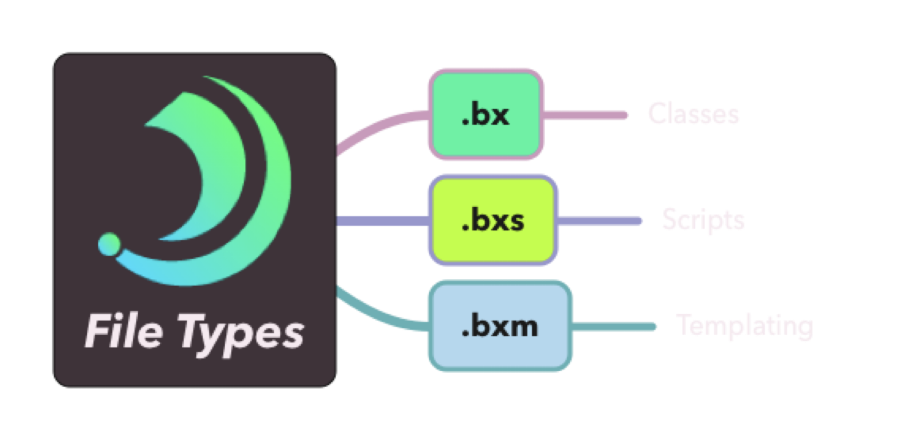

# 1.0.0-Beta10

BoxLang Betas are released weekly.  This is our tenth marker and we are incredibly excited to bring you a very big release.  This gives us a huge push forwards towards compatibility with other engines and many more new features we have always wanted in our language.  Enjoy!

## Release notes - BoxLang - 1.0.0-Beta10

## New Features

### [BL-435](https://ortussolutions.atlassian.net/browse/BL-435) transpile queryGetRow() to queryRowData()

Ths is a compatibility feature for CFML engines so they can use the `queryGetRow()` BIF which internally funnels to the [`queryRowData`](../../boxlang-language/reference/built-in-functions/query/QueryRowData.md)`()` method.


### [BL-436](https://ortussolutions.atlassian.net/browse/BL-436) Ini files support

CFML engines always had half baked support for working with INI files.  We now have full support and a fluent way to interact with `ini` files.  This is really important for those building IoT solutions or interacting with micro processor devices.  To get started use the boxlang installer `install-bx-module bx-ini` or if using CommandBox: `install bx-ini`

Here is a typical ini file example:

```ini
[General]
appName=MyApplication
version=1.2.3
author=John Doe
boxlang=rocks

[Database]
host=localhost
port=5432
username=dbuser
password=dbpass
dbname=mydatabase

[Logging]
logLevel=DEBUG
logFile=/var/log/myapp.log
maxFileSize=10MB

[Features]
enableFeatureX=true
enableFeatureY=false
maxConnections=100
```


Here are the contributed functions in this module:

* `getIniFile( file )` : Reads an ini file and returns the IniFile object. If the file does not exist, it will create it.
* `getProfileSection( iniFile, section )` : Gets a section from the ini file as a struct
* `getProfileSections( iniFile )` : Gets all the sections from the ini file as a struct of structs
* `getProfileString( iniFile, section, entry )` : Gets an entry from a section in the ini file, if it does not exist, it will return an empty string
* `setProfileString( iniFile, section, entry, value )` : Sets an entry in a section in the ini file, if the section does not exist, it will create it
* `removeProfileSection( iniFile, section )` : Removes a section from the ini file
* `removeProfileString( iniFile, section, entry )` : Removes an entry from a section in the ini file

The `IniFile` object is a fluent object that allows you to work with ini files in a very easy way. Here is an example of how to use it:

```groovy
// Get the ini file
var iniFile = getIniFile( "test.ini" );
iniFile.createSection( "mySettings" );
// Set a string
iniFile.setEntry( "section1", "entry1", "value1" );
// Get a string
var value = iniFile.getEntry( "section1", "entry1" );
// Remove a string
iniFile.removeEntry( "section1", "entry1" );
// Remove a section
iniFile.removeSection( "section1" );
```


### [BL-437](https://ortussolutions.atlassian.net/browse/BL-437) JSStringFormat BIF

This BIF is now complete to provide JavaScript escaping when using BoxLang as the template processor:

```javascript
<script>
let info = "#JSStringFormat( "An example string value with ""quoted"" 'text'" )#"
</script>
```


### [BL-439](https://ortussolutions.atlassian.net/browse/BL-439) xml component

We have now finalized XML support in BoxLang with a beautiful `xml` component:

```xml
<cfxml variable="myVar">
  <root>
    <foo attr="brad" />
    <foo attr="luis" />
    <foo attr="jon" />
  <root>
</cfxml>
```


### [BL-442](https://ortussolutions.atlassian.net/browse/BL-442) getVariable() & [BL-443](https://ortussolutions.atlassian.net/browse/BL-443) setVariable()

These two functions now exist in the `compat` module.  It allows you to set and get variables in the `variables` scope.  This can also be used to retrieve dynamic variable names or set dynamic variable names:

```gradle
setVariable( prepVar(), "hello" )

println( getVariable( getVar() ) )
```


### [BL-444](https://ortussolutions.atlassian.net/browse/BL-444) Add getClientVariablesList() to compat

Legacy `client` scope support added to the compat module


### [BL-448](https://ortussolutions.atlassian.net/browse/BL-448) New getDescendantsOfType() AST method with predicate

This is an internal method of our contexts to allow us to retrieve things easily with predicates.


### [BL-449](https://ortussolutions.atlassian.net/browse/BL-449) Implement single quote escapes in queries and preserveSingleQuotes

We thought this was going to be an easy one.  `preserveSingleQuotes()` is now built for the core language to assist when building dynamic SQL and escaping quotes smartly.


### [BL-450](https://ortussolutions.atlassian.net/browse/BL-450) Allow .cfm and .cfs files from the boxlang CLI runner

Our BoxLang runner now allows for the CLI execution of `cfm` and `cfs` files directly along side BoxLang templates.

```bash
boxlang task.cfm
boxlang script.cfs
```

## [BL-440](https://ortussolutions.atlassian.net/browse/BL-440) Add isNumericDate BIF

This BIF is now in the core thanks to a client migration.

### [BL-441](https://ortussolutions.atlassian.net/browse/BL-441) Add getHTTPTimeString BIF to web-support

Our web support package gets a new BIF thanks to a client migration

### [BL-143](https://ortussolutions.atlassian.net/browse/BL-143) Writedump label support

WriteDump in BoxLang now get beautiful labels!

<div align="left">

<figure><figcaption></figcaption></figure>

</div>

### [BL-447](https://ortussolutions.atlassian.net/browse/BL-447) java.math.BigInteger caster

We have a new caster for BigInteger and BigDecimal to help us with precise mathematics in BoxLang.

## Improvements

### [BL-425](https://ortussolutions.atlassian.net/browse/BL-425) When doing class serialization make sure to identify which properties have \`serialize=false\` on them

Our serializer to binary for classes now respects the `serialize` annotation on properties.

```cfscript
class{
    // serializable
    property name;
    // not serializable
    property boolean isLoggedIn deafult=false serializable=false

}
```


[BL-426](https://ortussolutions.atlassian.net/browse/BL-426) content component can have body

[BL-429](https://ortussolutions.atlassian.net/browse/BL-429) Enhance error messages for parsing invalid tag code


## Bugs

[BL-427](https://ortussolutions.atlassian.net/browse/BL-427) MalformedInputException: Input length = 1 when parsing CFC

[BL-428](https://ortussolutions.atlassian.net/browse/BL-428) component detection can be tricked if there is a tag comment line starting with the word "component"

[BL-432](https://ortussolutions.atlassian.net/browse/BL-432) Regression: Can't run files via BoxRunner due to new action command logic

[BL-451](https://ortussolutions.atlassian.net/browse/BL-451) Sometimes trying to shutdown runtime throws NPE if it was never started fully

[BL-452](https://ortussolutions.atlassian.net/browse/BL-452) pretty print visitor outputting extra " on tag catch block

[BL-453](https://ortussolutions.atlassian.net/browse/BL-453) pretty print visitor doesn't handle array notation invocation

