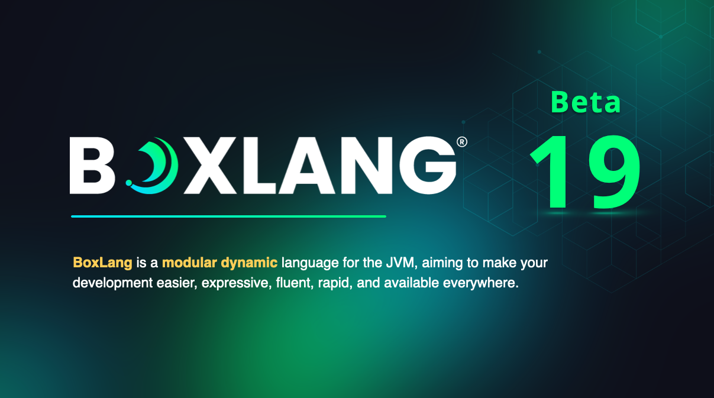
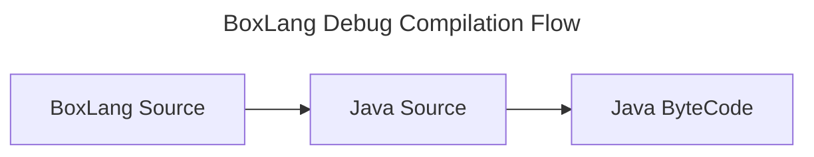
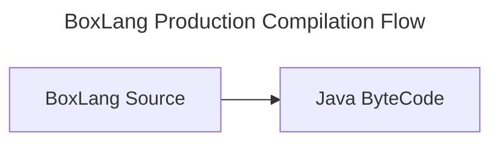

# 1.0.0-Beta19

<figure><figcaption></figcaption></figure>

## New Features

### [BL-667](https://ortussolutions.atlassian.net/browse/BL-667) ASMBoxPiler to do direct Java bytecode creation

With the implementation of the **ASMBoxPiler**, developers can now compile BoxLang source code directly into Java bytecode, streamlining the process and improving performance by over 4 times. This feature eliminates the intermediate steps previously required for code execution, resulting in faster compilation times and seamless integration with Java environments.&#x20;



The **JavaBoxPiler** will remain in BoxLang as it's an integral debugging piece.  It might be moved later to it's own module, but having the capability to transpile BoxLang/CFML code to Java will remain.



The direct bytecode generation allows for enhanced optimization and leverages the full potential of Java's JVM, leading to more efficient and scalable applications.  By default, right now this is an experimental feature and it will need to be turned ON in order to use it via our `boxlang.json` configuration, via the `compiler : "asm"`

```json5
// This is the experimental features flags.
// Please see the documentation to see which flags are available
"experimental": {
	// This choose the compiler to use for the runtime
	// Valid values are: "java", "asm"
	"compiler": "java",
	// If enabled, it will generate AST JSON data under the project's /grapher/data folder
	"ASTCapture": false
},
```

### [BL-232](https://ortussolutions.atlassian.net/browse/BL-232) Star-import for boxlang classes

You can now use `*` imports for BoxLang classes, which allows you to bring in all the classes found in the imported package into the class namespace so you can create them by just using their name.  In practice, the use of star-imports is a trade-off between convenience and potential issues such as namespace collisions. While they can make code more concise, especially when many classes from a package are needed, they may also import unintended classes, leading to ambiguities. Therefore, it's generally recommended to use specific imports when only a few classes are required and reserve star-imports for when numerous classes from the same package are genuinely required.

```java
import cbvalidation.models.*;
import cbvalidation.models.result.*;

class accessors="true" serialize="false" singleton {

    ...
    // cbvalidation.models.GenericObject
    target = new GenericObject( arguments.target )
    
    ...

}
```

### [BL-653](https://ortussolutions.atlassian.net/browse/BL-653) Java wildcard imports from loaded jars

The feature [BL-653](https://ortussolutions.atlassian.net/browse/BL-653) enhances import capabilities by allowing Java wildcard imports from loaded JAR files. This means you can use the `*` notation to import all classes within a JAR package, reducing the need to import each class manually. This functionality streamlines the process of utilizing numerous classes within a package and is particularly beneficial when dealing with extensive libraries. However, similar to BoxLang star-imports, it is essential to be aware of possible namespace conflicts and ensure that unintended classes do not get imported, maintaining code clarity and preventing ambiguity.

```java
// Star-import of all classes in the package
import org.apache.commons.lang3.*;

class{
    
    function main( args=[] ){
        // Using StringUtils from Apache Commons Lang
        var reversed = StringUtils.reverse("BoxLang");
        println("Reversed: " + reversed);

        // Using RandomStringUtils from Apache Commons Lang
        var randomString = RandomStringUtils.randomAlphanumeric(10);
        println("Random String: " + randomString);
    }
}
```

### [BL-646](https://ortussolutions.atlassian.net/browse/BL-646) Ability to import/create BoxLang classes from modules via direct \`@{moduleName}\` notation.

The @ notation in BoxLang’s import system allows for more efficient and precise class referencing. By explicitly addressing classes from a specific module, performance is improved because it avoids the need for BoxLang to search through all available modules, reducing ambiguity in cases where classes with the same name exist in different modules. The module’s root serves as the base for addressing the class.

Here’s a breakdown of how it works:

```java
// Import from the cborm module
import models.ActiveEntity@cborm
target = new ActiveEntity()

// Import from the cborm module using aliases
import models.ActiveEntity@cborm as AC
target = new AC()
```

By using this method, developers can avoid potential issues like performance degradation due to unnecessary module scanning and the possibility of naming conflicts. It provides a clear and concise way to manage dependencies and class imports in BoxLang.

### [BL-647](https://ortussolutions.atlassian.net/browse/BL-647) Ability to import create java classes from modules explicitly using the \`@\`notation

Just like with BoxLang classes, you can also do the same for all Java libraries modules are packaged with.  This allows you to import and create Java classes from specific modules by addressing them using the `@` notation.

```java
// Importing a specific class from the ESAPI Module
import org.owasp.esapi.ESAPI@bx-esapi
encoder = ESAPI.encoder()

// Importing and aliasing a class from the ESAPI library
import org.owasp.esapi.ESAPI@bx-esapi as SecurityAPI
encoder = SecurityAPI.encoder()

// Creating Java Classes
encoder = new java:org.owasp.esapi.reference.DefaultEncoder@bx-esapi();

```

The following were support tickets for all of these functionalities

* [BL-648](https://ortussolutions.atlassian.net/browse/BL-648) Import Definitions now support module addressing for simple, wildcard and aliases
* [BL-657](https://ortussolutions.atlassian.net/browse/BL-657) JavaResolver module targeted resolution

### [BL-658](https://ortussolutions.atlassian.net/browse/BL-658) MIgrate AST Capture to it's own experimental flag

If you want to capture AST JSON for debugging purposes you will need to activate the new AST experimental flag:

```json5
// This is the experimental features flags.
// Please see the documentation to see which flags are available
"experimental": {
	// This choose the compiler to use for the runtime
	// Valid values are: "java", "asm"
	"compiler": "java",
	// If enabled, it will generate AST JSON data under the project's /grapher/data folder
	"ASTCapture": true
},
```

### [BL-612](https://ortussolutions.atlassian.net/browse/BL-612) Add STOMP subprotocols in miniserver

We continue to make great strides with easy websocket support for BoxLang.  Now we have added our very own STOMP implementation which makes our websockets behave like AMQP Messaging Brokers like RabbitMQ.

[https://community.ortussolutions.com/t/introducing-the-socketbox-stomp-broker-demo/10396](https://community.ortussolutions.com/t/introducing-the-socketbox-stomp-broker-demo/10396)


## Improvements

[BL-328](https://ortussolutions.atlassian.net/browse/BL-328) Move `CFID` to compat module

[BL-637](https://ortussolutions.atlassian.net/browse/BL-637) Have servlet runtime return actual pagecontext object instead of fake

[BL-644](https://ortussolutions.atlassian.net/browse/BL-644) Update the `allowedFileOperationExtensions` and `disallowedFileOperationExtensions` to the security block

[BL-650](https://ortussolutions.atlassian.net/browse/BL-650) Allow casting to array of primitive types

[BL-652](https://ortussolutions.atlassian.net/browse/BL-652) Improve exception when trying to invoke null as a function

[BL-654](https://ortussolutions.atlassian.net/browse/BL-654) Get ColdBox Loading via ASM

[BL-655](https://ortussolutions.atlassian.net/browse/BL-655) Improve logic surrounding loading of pre-compiled source files

[BL-660](https://ortussolutions.atlassian.net/browse/BL-660) added a \`isCommitted()\` to the PageContext to match the servlet response to assist when doing resets without exceptions

[BL-661](https://ortussolutions.atlassian.net/browse/BL-661) StopGaps and config from cfconfig.json to boxlang.json

[BL-662](https://ortussolutions.atlassian.net/browse/BL-662) NotImplemented updated to check if it's a string and if empty, then ignore it to provide leeway

[BL-666](https://ortussolutions.atlassian.net/browse/BL-666) Rename default sessions cache to \`bxSessions\` to create the \`bx\` prefix standards. Add configuration to boxlang.json


## Bug

[BL-635](https://ortussolutions.atlassian.net/browse/BL-635) boxlang invokes private onApplicationStart

[BL-636](https://ortussolutions.atlassian.net/browse/BL-636) expandPath does not preserve file system case

[BL-639](https://ortussolutions.atlassian.net/browse/BL-639) cfml2wddx action missing

[BL-642](https://ortussolutions.atlassian.net/browse/BL-642) deserializeJSON not handling white space / control characters

[BL-645](https://ortussolutions.atlassian.net/browse/BL-645) Update parser to allow for \`@module\` notations on imports and \`new\` operators

[BL-649](https://ortussolutions.atlassian.net/browse/BL-649) listFind() and listFindNoCase() are allowing partial matches

[BL-651](https://ortussolutions.atlassian.net/browse/BL-651) Can't dump null in console

[BL-659](https://ortussolutions.atlassian.net/browse/BL-659) Cannot invoke "java.lang.CharSequence.length()" because "this.text" is null

