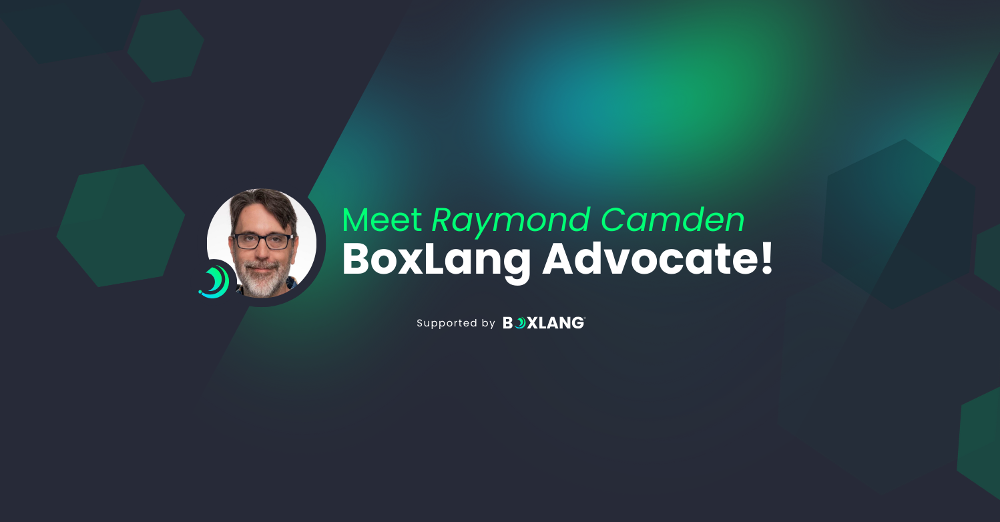

# 1.0.0-RC.2

🚀 **BoxLang Release Candidate 2 is Here!** 🚀

We’re entering the final stretch of our pre-releases, and we couldn’t be more excited to introduce RC2! 🚀 This release marks a major leap in performance and compatibility, the result of over six months of intensive development. Beyond enhanced stability and seamless integration, RC2 delivers game-changing performance optimizations that push the boundaries of efficiency. Get ready for our fastest, most refined release yet!

### Feel the Need for Speed :rocket::fire:

RC2 is blazing fast! 🚀 Our latest release delivers unmatched performance in both parsing and runtime execution, outperforming Adobe ColdFusion 2021 and 2023 by 25-37% in many scenarios. These results are backed by rigorous certification testing across TestBox, ColdBox, and over 35 modules, ensuring real-world speed and reliability.  You can now check all of our repos and see the performance for yourself.

### Adobe ColdFusion / Lucee Drop-In Replacement

This means you can **seamlessly** migrate your Adobe ColdFusion or Lucee applications to BoxLang with no code changes—and they’ll run faster, smoother, and across multiple runtimes! 🚀

But that’s not all—our subscription-based licensing can save you over 70% compared to Adobe ColdFusion, with no restrictions on cores or limitations on SaaS and multi-tenant applications. **No restrictions. Just pure freedom to scale.** 🔥

### Ray Camden BoxLang Evangelist

<figure><figcaption></figcaption></figure>

We’re excited to welcome Raymond Camden, a renowned leader in the CFML community, as a BoxLang Advocate! 🎉

Raymond, currently collaborating with us as a contractor, brings deep expertise in web development and a passion for making complex technologies more accessible. His insights and experience make him the perfect advocate to explore and champion BoxLang—our modern, CFML-compatible programming language. 🚀

[Read More](https://www.ortussolutions.com/blog/meet-raymond-camden-boxlang-advocate)

### Premium Modules Have Landed

We have now our first premium module for BoxLang +/++ subscribers: BX-REDIS.  Our `bx-redis`module is now available for you to use if you have a subscription.  You can also try it out free of charge by installing it today:

```
# OS
install-bx-module bx-redis

# CommandBox
box install bx-redis
```

Giving you great capabilities for caching, distributed sessions, pub-subscribe and much more.  You can find out about this initial release here ([https://forgebox.io/view/bx-redis](https://forgebox.io/view/bx-redis))



### Licenses Available!


www.boxlang.io/plans


Remember that our **support license subscriptions (**[**https://www.boxlang.io/plans**](https://www.boxlang.io/plans)**)** for BoxLang **+/++ are available now.  O**ffering enterprise-grade support, priority fixes, premium modules, and exclusive benefits. As an introductory offer, all licenses are available at 2&#x35;**% off** for March.

### Production Tips

We encourage you to pre-compile your applications using our BoxLang compiler for incredibly safe and high-performance deployments since no parsing is involved.  Combined with our new [trusted cache settings](../../getting-started/configuration/directives.md), your applications will fly and be highly performant.&#x20;

***

## Release Notes

### Improvements

[BL-1021](https://ortussolutions.atlassian.net/browse/BL-1021) Explore speed improvements to parser

[BL-1084](https://ortussolutions.atlassian.net/browse/BL-1084) Support CF syntax of space inside elvis operator

[BL-1089](https://ortussolutions.atlassian.net/browse/BL-1089) allow getSystemSetting() to default to a non-simple value

[BL-1090](https://ortussolutions.atlassian.net/browse/BL-1090) bx-compat - Client Scope Listener should not start up or look for cache if client management is disabled

[BL-1093](https://ortussolutions.atlassian.net/browse/BL-1093) Make miniserver bind to 0.0.0.0 by default

[BL-1143](https://ortussolutions.atlassian.net/browse/BL-1143) Change order of app shutdown

[BL-1147](https://ortussolutions.atlassian.net/browse/BL-1147) boxAnnounce() and boxAnnounceAsync() get a poolname so you can announce globally or to the request pools

[BL-1148](https://ortussolutions.atlassian.net/browse/BL-1148) missing bif: BoxRegisterInterceptionPoints() to register interception points for global or request pools

[BL-1149](https://ortussolutions.atlassian.net/browse/BL-1149) In BL files, only default output=false in tag-based UDFs

[BL-1153](https://ortussolutions.atlassian.net/browse/BL-1153) Setup the hikari defaults for connection pooling to modern standards

[BL-1155](https://ortussolutions.atlassian.net/browse/BL-1155) Update query object to return array of structs into a consolidated method: toArrayOfStructs()

[BL-1158](https://ortussolutions.atlassian.net/browse/BL-1158) Attempts needed remail of left over isSimplevalue evaluations

[BL-1159](https://ortussolutions.atlassian.net/browse/BL-1159) Rename bx:module to be bx:component

### Bugs

[BL-1018](https://ortussolutions.atlassian.net/browse/BL-1018) esapiEncode does not allow an zero length input string

[BL-1024](https://ortussolutions.atlassian.net/browse/BL-1024) BX-ORM: Datasource with name \[defaultDatasource] not found in the application or globally

[BL-1026](https://ortussolutions.atlassian.net/browse/BL-1026) \`try\`/\`finally\` doesn't always run \`finally\`

[BL-1036](https://ortussolutions.atlassian.net/browse/BL-1036) ASM regression - break exiting out of more than just the loop

[BL-1056](https://ortussolutions.atlassian.net/browse/BL-1056) LinkedHashMap right-hand assignments are always null.

[BL-1063](https://ortussolutions.atlassian.net/browse/BL-1063) ReEscape result doesn't match ACF

[BL-1064](https://ortussolutions.atlassian.net/browse/BL-1064) Classes getting cleared in debug mode

[BL-1077](https://ortussolutions.atlassian.net/browse/BL-1077) Simplify CLI to install modules

[BL-1078](https://ortussolutions.atlassian.net/browse/BL-1078) cgi items not being found until you access them

[BL-1079](https://ortussolutions.atlassian.net/browse/BL-1079) encrypt not working with AES and UU

[BL-1080](https://ortussolutions.atlassian.net/browse/BL-1080) Encrypt Fails when salt is below 16 bytes in length

[BL-1082](https://ortussolutions.atlassian.net/browse/BL-1082) bx-mail not reading mail configurations

[BL-1085](https://ortussolutions.atlassian.net/browse/BL-1085) HTTP - Ensure all exceptions are caught and handled

[BL-1086](https://ortussolutions.atlassian.net/browse/BL-1086) Mail Module not Loading root-level boxlang.json Mail Server Settings

[BL-1087](https://ortussolutions.atlassian.net/browse/BL-1087) StructUtil.deepMerge wraps arrays in nested array if left hand side contains the same array

[BL-1088](https://ortussolutions.atlassian.net/browse/BL-1088) Can't set cookies using a struct

[BL-1092](https://ortussolutions.atlassian.net/browse/BL-1092) Mail: Classloader issues when sending MultiPart email in Servlet Context

[BL-1094](https://ortussolutions.atlassian.net/browse/BL-1094) \`.duplicate()\` Member Method Not Available on Struct,DateTime objects, Queries and Arrays

[BL-1095](https://ortussolutions.atlassian.net/browse/BL-1095) DirectoryCopy Does not Allow Closure for Filter Arg

[BL-1096](https://ortussolutions.atlassian.net/browse/BL-1096) QueryNew Does not accept array of Columns as only first arg

[BL-1097](https://ortussolutions.atlassian.net/browse/BL-1097) Compat: CachePut does not allow numeric decimal number of days for timeSpan or idleTime

[BL-1099](https://ortussolutions.atlassian.net/browse/BL-1099) String Hash Result Different Between Text and Byte Array

[BL-1100](https://ortussolutions.atlassian.net/browse/BL-1100) Compat: HTTP result.statusCode Does not Include the status text.

[BL-1101](https://ortussolutions.atlassian.net/browse/BL-1101) HTTP Request for Binary Object casts fileContent to String

[BL-1102](https://ortussolutions.atlassian.net/browse/BL-1102) Integer caster not always consistent

[BL-1103](https://ortussolutions.atlassian.net/browse/BL-1103) HTTP Component getAsBinary attribute does not support \`true\` and \`false\` boolean arguments

[BL-1104](https://ortussolutions.atlassian.net/browse/BL-1104) HTTP Component throws an error when \`Host\` is explicitly passed as a header

[BL-1105](https://ortussolutions.atlassian.net/browse/BL-1105) HTTP Component Throws Error when sending Binary Content

[BL-1106](https://ortussolutions.atlassian.net/browse/BL-1106) HTTP getAsBinary should be treated as an explicit request for binary content unless \`never\` is passed.

[BL-1109](https://ortussolutions.atlassian.net/browse/BL-1109) HTTP: Query Params Are Being Double Encoded Even When Encode=false

[BL-1110](https://ortussolutions.atlassian.net/browse/BL-1110) Within a cfmodule, the variables scope is not available within a .each() loop if the .each loop is called in a function within the module.

[BL-1111](https://ortussolutions.atlassian.net/browse/BL-1111) When a form is submitted but none of the inputs have names and the form scope is dumped, an error is thrown

[BL-1112](https://ortussolutions.atlassian.net/browse/BL-1112) Type coercion of an numeric argument passed to java constructor is not being done

[BL-1113](https://ortussolutions.atlassian.net/browse/BL-1113) Function NOT not found

[BL-1114](https://ortussolutions.atlassian.net/browse/BL-1114) bx-orm - 'Datasource with name \[defaultDatasource] not found ...'

[BL-1115](https://ortussolutions.atlassian.net/browse/BL-1115) bx-orm - Unable to call generated methods from within class

[BL-1116](https://ortussolutions.atlassian.net/browse/BL-1116) bx-orm - Generated method hasX() is missing support for value comparison

[BL-1117](https://ortussolutions.atlassian.net/browse/BL-1117) bx-orm - AddX() method fails on many-to-many relationship properties with "bag is null" error

[BL-1118](https://ortussolutions.atlassian.net/browse/BL-1118) HMAC Method not supporting binary keys

[BL-1120](https://ortussolutions.atlassian.net/browse/BL-1120) HTTP \`file\` attribute not implemented

[BL-1121](https://ortussolutions.atlassian.net/browse/BL-1121) Math Operations Leave trailing zeros after operation when result is whole number

[BL-1122](https://ortussolutions.atlassian.net/browse/BL-1122) HTTP ACF and Lucee Treat all Unknown or malformed \`Content-Type\` Headers as a string response

[BL-1124](https://ortussolutions.atlassian.net/browse/BL-1124) Compat: Default throw error not a type of \`Application\`

[BL-1125](https://ortussolutions.atlassian.net/browse/BL-1125) Error compiling - 'in' was unexpected expecting one of ...

[BL-1126](https://ortussolutions.atlassian.net/browse/BL-1126) this.customtagpaths not respected - Could not find custom tag

[BL-1128](https://ortussolutions.atlassian.net/browse/BL-1128) Common Text Cert/Key extensions are being read as Binary data

[BL-1129](https://ortussolutions.atlassian.net/browse/BL-1129) for loop using var and in throws parsing error

[BL-1130](https://ortussolutions.atlassian.net/browse/BL-1130) Custom Error Thrown Is Being Wrapped in "Error invoking Supplier" exception

[BL-1132](https://ortussolutions.atlassian.net/browse/BL-1132) FileRead should only ever return strings

[BL-1133](https://ortussolutions.atlassian.net/browse/BL-1133) DateTime Comparison equals/isEqual discrepancies

[BL-1134](https://ortussolutions.atlassian.net/browse/BL-1134) DateCompare Issues when Time units are specified

[BL-1135](https://ortussolutions.atlassian.net/browse/BL-1135) DateAdd No Longer Allowing Decimals

[BL-1137](https://ortussolutions.atlassian.net/browse/BL-1137) Allow customTagPaths to be relative

[BL-1138](https://ortussolutions.atlassian.net/browse/BL-1138) EqualsEquals operator should use \`equalTo\` method of DateTime in compat mode

[BL-1139](https://ortussolutions.atlassian.net/browse/BL-1139) Cannot pass BoxLang Functions into ScheduledTask

[BL-1140](https://ortussolutions.atlassian.net/browse/BL-1140) Nested config values for modules do not get replaced by environment variables

[BL-1142](https://ortussolutions.atlassian.net/browse/BL-1142) thread safety issue in feature audit

[BL-1144](https://ortussolutions.atlassian.net/browse/BL-1144) Custom setter that assigns to this scope causes stack overflow with implicit accessor invocation

[BL-1146](https://ortussolutions.atlassian.net/browse/BL-1146) return type of function not always parsing

[BL-1150](https://ortussolutions.atlassian.net/browse/BL-1150) Invalid stack height when using a ternary in a context that doesn't expect a return value

[BL-1151](https://ortussolutions.atlassian.net/browse/BL-1151) semicolon not allowed after pre annotation

[BL-1152](https://ortussolutions.atlassian.net/browse/BL-1152) \`variablename\` is not supported as a type

[BL-1156](https://ortussolutions.atlassian.net/browse/BL-1156) Compat: Date Comparisons in Compat should only be precise to the second

[BL-1157](https://ortussolutions.atlassian.net/browse/BL-1157) len() BIF needs to treat byte arrays as an array, not a string

[BL-1160](https://ortussolutions.atlassian.net/browse/BL-1160) return not expr parsing error

### Tasks

[BL-814](https://ortussolutions.atlassian.net/browse/BL-814) CBSecurity Certification

[BL-1076](https://ortussolutions.atlassian.net/browse/BL-1076) isWDDX BIF missing from wddx module
