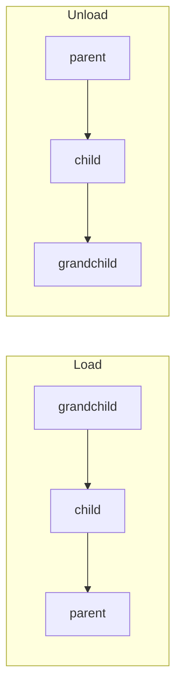
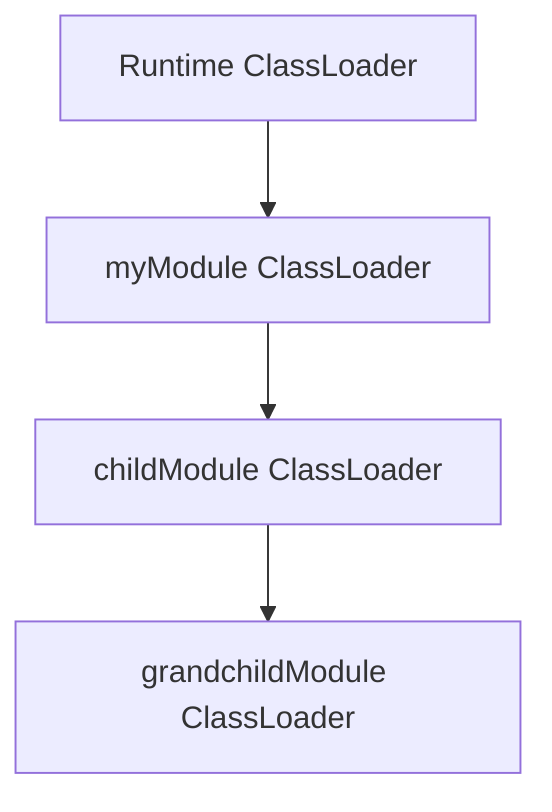

# 1.17.0

**BoxLang 1.17.0** is headlined by **Module Inception** — modules can now bundle other modules inside themselves, recursively, each with its own isolated class loader chained to its parent. It's a small change in the file system, but an architectural one for the language: BoxLang is now a genuinely **hierarchical modular language**, where a single module is a self-contained artifact that ships its own dependency tree instead of asking users to install a list of separate modules in the right order. Beyond that headline, this release is otherwise security-and-operability focused: **encrypted configuration secrets** (`bxsecret:`) keep datasource passwords out of plain-text config, `include` is now hardened against path injection, `xmlParse()`/`xmlTransform()` gain explicit XXE-hardening controls, and the core runtime sheds `evaluate()`/`precisionEvaluate()` into an opt-in module. This release closes **32 issues** across new features, improvements, and bug fixes.

## 🚀 Major Highlight: Module Inception

Every other module ecosystem you've worked in is **flat** — you declare a list of dependencies, and something outside the language (a package manager, a build tool) resolves, downloads, and orders them for you. BoxLang 1.17.0 changes that. A module is now a **tree**: it can carry other modules inside it, and BoxLang's own `ModuleService` discovers, registers, activates, and unloads that whole tree itself, recursively, to any depth, with zero external tooling.

That means you can ship **one self-contained artifact** — a single module folder or a single JAR — that brings every module it depends on along with it, fully isolated from the host application's own modules, and it just works the moment it's dropped in.

### The convention

Drop a `modules/` folder into your module, and BoxLang treats it exactly like a top-level `modulesDirectory`. Anything inside it can be either kind of module:

```
myModule/
├── box.json
├── ModuleConfig.bx
├── bifs/
├── libs/
│   └── some-dependency.jar        ← a plain library on myModule's classpath
└── modules/                       ← modules bundled inside this one
    ├── childModule/                ← a full module folder
    │   ├── ModuleConfig.bx
    │   └── modules/                ← which nests further, to any depth
    │       └── grandchildModule/
    │           └── ModuleConfig.bx
    └── javaHelper.jar               ← a JAR module, not just a library
```


`libs/` and `modules/` are not the same thing. A JAR in `libs/` is a **library** on your module's classpath. A JAR in `modules/` is a **module** with its own lifecycle, settings, and class loader.


### Load order and isolation

Nested modules load from the inside out and unload from the outside in — by the time your module's own `onLoad()` runs, everything it bundles is already active and usable:



Isolation is real, not conventional: the class loader hierarchy mirrors the module hierarchy. A nested module's loader is parented to **its parent module's** loader, chaining upward to the runtime — so a child can see everything its parent bundles in `libs/`, without redeclaring it, while staying isolated from unrelated modules entirely:



### JAR modules — a module with no folder at all

The other half of Inception: a bare `*.jar` sitting in a `modules/` folder **is** a module. No `ModuleConfig.bx`, no `box.json` — its descriptor is a Java `IModuleConfig` discovered via `ServiceLoader`, and its metadata comes from a `@BoxModule` annotation:

```java
@BoxModule(
    name        = "javaHelper",
    version     = "1.0.0",
    author      = "Ortus Solutions",
    description = "A module shipped as a single JAR"
)
public class JavaHelperModule implements IModuleConfig {

    @Override
    public void configure( IBoxContext context, ModuleRecord moduleRecord ) {
        moduleRecord.settings.put( Key.of( "mode" ), "fast" );
    }

}
```

This is what makes bundled dependencies practical: a pure-Java library your module needs can ship as a first-class module in its own right, without a `.bx` file anywhere in sight.

### A parent can override what it bundles

Nesting a module doesn't mean losing control over it. A parent declares a `this.modules` struct mirroring the `boxlang.json` shape, and it lands in the middle of a three-layer precedence chain — the global app config still wins over everything, so a deployment can always override a bundled module's own decisions about itself:

```js
// myModule/ModuleConfig.bx
class {

    this.version = "1.0.0"

    this.modules = {
        "childModule" : {
            enabled  : true,
            settings : {
                timeout  : 60,
                endpoint : "https://internal.example.com"
            }
        }
    }

}
```


### Inspecting the whole tree

Nested modules stay in the same flat registry as everything else — their BIFs, components, and mappings work exactly like a top-level module's — but you can also walk the hierarchy explicitly with the new `getModuleTree()` BIF:

```js
tree = getModuleTree()

for ( moduleName in tree ) {
    node = tree[ moduleName ]
    writeOutput( "#moduleName# (v#node.version#)" )
    for ( childName in node.children ) {
        writeOutput( "  ↳ #childName#" )
    }
}

// Or scope it to one module's own subtree
subtree = getModuleTree( "myModule" )
```

**Why this matters:** module authors no longer have to choose between "one giant module that does everything" and "many small modules the user has to install and order correctly." A module can now be exactly as granular as makes sense internally, while presenting as a single install to the outside world — and because the class loader isolation is real, nested modules never leak their dependencies into modules that don't ask for them.


This is documented in full — including the known shutdown-ordering limitation across unrelated modules — at [Module Inception](../../boxlang-framework/module-development/module-inception.md).


## ✨ New Features

### Module Inception — Nested and Jar-Based Modules (BL-2632)

See the Major Highlight section above for the full treatment.

### Encrypted Configuration Secrets — `bxsecret:` (BL-2618)

BoxLang 1.17.0 introduces first-class encryption for sensitive values inside `boxlang.json` and `Application.bx` settings. Instead of committing a plain-text datasource password (or relying entirely on environment variable substitution), you can now encrypt a value once and drop the ciphertext straight into your config.

Generate an encrypted value with the new `generatesecret` CLI action, using the runtime's active secret seed:

```bash
boxlang generatesecret "s3cr3tPassw0rd"
# => bxsecret:AbCdEf123...==
```

Then use it anywhere a config value is read — BoxLang decrypts it automatically at load time:

```json
{
	"datasources": {
		"myDS": {
			"driver": "mysql",
			"properties": {
				"host": "localhost",
				"database": "myapp"
			},
			"username": "app_user",
			"password": "bxsecret:AbCdEf123...=="
		}
	}
}
```

`bxsecret:` values can also live inside a `${...}` placeholder, so you can combine encryption with environment-driven overrides in the same config tree:

```json
"password": "${env.DB_PASSWORD:bxsecret:AbCdEf123...==}"
```

The decryption key (the "seed") is auto-generated and persisted per-install, or you can pin it explicitly for reproducible deployments via an environment variable or JVM system property:

```bash
export BOXLANG_SECURITY_SECRETSEED=my-shared-seed-value
```


This builds directly on BoxLang's existing [environment variable substitution](../../getting-started/configuration.md#environment-variable-substitution) (`${env.VAR:default}`) — the underlying placeholder resolver was improved in this same release (BL-2648) so both mechanisms compose cleanly.


### Global Error Template (BL-1295)

A new `globalErrorTemplate` runtime setting points at a `.bxm` template rendered for unhandled errors, as a runtime-wide fallback distinct from a per-`Application.bx` [`onError()`](../../boxlang-framework/applicationbx.md) listener:

```json
{
	"globalErrorTemplate": "/errors/global-error.bxm"
}
```

Leave it empty (the default) to keep BoxLang's built-in error page.

### HTTP Request Start/Stop Debug Logging (BL-2616)

Every `bx:http` request now logs its start and completion at `DEBUG` through the dedicated `http` logger category, including status code and elapsed time — no component attribute required, just raise the logger's level:

```json
{
	"logging": {
		"loggers": {
			"http": { "level": "DEBUG" }
		}
	}
}
```

```js
bx:http url="https://api.example.com/users" method="GET" result="res"
// DEBUG  Starting HTTP REQUEST ... {URL='https://api.example.com/users', method='GET'}
// DEBUG  HTTP REQUEST ... completed {Status Code=200, Time taken=142ms}
```

### `boxlang check` CLI Command (BL-2627)

A dedicated `check` action command validates one or more `.bx`, `.bxs`, `.bxm`, `.cfm`, `.cfc`, or `.cfs` files for syntax errors **without executing or compiling them** — ideal for pre-commit hooks, CI pipelines, and editor integrations.

```bash
boxlang check myapp.bx myComponent.cfc

boxlang check --source ./src --format json
```


Full reference: [BoxLang Syntax Check](../../getting-started/ide-tooling/boxlang-syntax-check.md).


## 🔧 Improvements

### `include` Is Now Enforced Relative (BL-2644)

`include` (and `bx:include`) can no longer escape your application's mappings to read arbitrary files off the filesystem. Previously, an absolute-looking path handed to `include` — whether hardcoded or, worse, built from user input — could be resolved directly against the OS filesystem:

```js
// Before 1.17.0: an absolute-looking path was resolved directly
// against the OS filesystem
include "/etc/passwd"

// 1.17.0: the same call is now forced relative — it resolves
// against your configured mappings/webroot instead, so it
// 404s / throws MissingIncludeException rather than reading the OS file
include "/etc/passwd"
```

This closes a template-injection/local-file-inclusion class of bug where a dynamically built include path could reach outside the application. Ordinary relative includes (`include "partials/header.bxm"`) are completely unaffected.

### A Leaner, Safer Core — `evaluate()` Moves Out (BL-2615)

`evaluate()` and `precisionEvaluate()` — dynamic evaluation of a string as BoxLang code — are no longer part of the core runtime. Because arbitrary string evaluation is an injection/RCE surface when fed untrusted input, both functions now ship exclusively in the separate, opt-in **`bx-unsafe-evaluate`** module:

```bash
# OS-wide install
install-bx-module bx-unsafe-evaluate

# Or via CommandBox
box install bx-unsafe-evaluate
```

If your application calls `evaluate()` or `precisionEvaluate()` and you upgrade to 1.17.0 without installing the module, those calls will fail to resolve — install the module to restore the previous behavior.

### Improved Config Placeholder Resolver (BL-2648)

* **[BL-2648](https://ortussolutions.atlassian.net/browse/BL-2648)** — Bare environment-variable names now resolve alongside the existing `env.` prefix, JVM system properties take precedence for bare names, and placeholder resolution now also runs against struct **keys** in nested config, not just values. This is the same resolver `bxsecret:` decryption hooks into (see New Features above).

### JAR Locking, PDF, and Other Runtime Fixes

* **[BL-2629](https://ortussolutions.atlassian.net/browse/BL-2629)** — `DynamicClassLoader` no longer locks the original JAR files it loads (including JARs referenced by `javaSettings` in `Application.bx`) — each JAR is copied to a temp file before loading, preventing Windows file-lock issues on hot-reload. Controlled by the `jarTempFileCaching` setting (default `true`).

```js
bx:application
	name = "myApp"
	javaSettings = {
		loadPaths : [ "/path/to/libs/helloworld.jar" ]
	}
// The original helloworld.jar is no longer held open/locked by the runtime
```

* **[BL-2614](https://ortussolutions.atlassian.net/browse/BL-2614)** — Fixed PDF rendering compatibility issues in the PDF generation pipeline.
* **[BL-2622](https://ortussolutions.atlassian.net/browse/BL-2622)** — Added an Adobe-compat option to permit leading zeros in JSON numeric literals (e.g. `{ "foo": 01 }`), matching Adobe ColdFusion's lenient JSON parsing.
* **[BL-2638](https://ortussolutions.atlassian.net/browse/BL-2638)** — `dump()` now renders a `java.lang.Character` instance using the same compact string template as a `String`, instead of a generic object dump.

```js
dump( "Alice".charAt( 1 ) )
// Now dumps like a one-character string, not a raw Character object
```

* **[BL-2639](https://ortussolutions.atlassian.net/browse/BL-2639)** — Member-function lookup by type now correctly matches a custom BoxLang class as the receiver type, not just built-in types.
* **[BL-2641](https://ortussolutions.atlassian.net/browse/BL-2641)** — CF-compat: accessing a query column at a row index beyond the query's record count now returns an empty string instead of throwing, matching Adobe/Lucee leniency.
* **[BL-2642](https://ortussolutions.atlassian.net/browse/BL-2642)** — Consolidated Java interop method/constructor/field lookups onto a single shared method-handle cache per class loader, improving lookup consistency and reducing memory overhead.
* **[BL-2645](https://ortussolutions.atlassian.net/browse/BL-2645)** — Fixed a memory leak where `Application` objects (and their `ApplicationScope`) could remain reachable and un-GC'able after application shutdown.
* **[BL-2646](https://ortussolutions.atlassian.net/browse/BL-2646)** — Added an automatic background watchdog that evicts the parser's ANTLR DFA cache when it has been idle for a few minutes or has grown large, preventing long-running server processes from accumulating unbounded parser memory. Controlled by the experimental flag `experimental.clearParserCache` (default `true`).

## 🐛 Bug Fixes

### Security — XML Security Configuration for `xmlParse()` / `xmlTransform()` (BL-2617)

CFML compatibility mode gains explicit control over XML parsing security — external entity resolution, DOCTYPE declarations, and secure processing can now be configured globally or per-call, closing off XXE-style attack vectors in code that parses untrusted XML.

Configure the defaults once, application-wide:

```json
{
	"xml": {
		"secureProcessing": true,
		"disallowDoctypeDeclaration": true,
		"allowExternalEntities": false,
		"lenientProcessing": false
	}
}
```

Or override them per-call by passing a struct as the `validator` argument to `xmlParse()`:

```js
xmlDoc = xmlParse(
	xml = untrustedXmlString,
	validator = {
		secureProcessing            : true,
		disallowDoctypeDeclaration  : true,
		allowExternalEntities       : false
	}
)
```

`validator` still accepts the original XSD path/URL string for schema validation — passing a struct instead switches it to security-settings mode. `xmlTransform()` automatically picks up the same application-level XML security defaults when handed a raw XML string.


See [`xmlParse()`](../../boxlang-language/reference/built-in-functions/xml/XMLParse.md) and [`xmlTransform()`](../../boxlang-language/reference/built-in-functions/xml/XMLTransform.md) for the full argument reference.


### Dump & Debugging

* **[BL-1862](https://ortussolutions.atlassian.net/browse/BL-1862)** — Fixed a discrepancy between BoxLang and Lucee in how `dump()`'s `depth` argument counts nesting levels; `depth` is now 1-based to match Lucee (`-1` unlimited, `0` nothing, `1` top level only, `2` one level of recursion, etc.).

### File & I/O

* **[BL-2619](https://ortussolutions.atlassian.net/browse/BL-2619)** — Fixed `BoxFile` throwing when opening a file that sits directly in a Windows drive root (e.g. `C:\file.txt`), where the parent path resolves to `null`.
* **[BL-2620](https://ortussolutions.atlassian.net/browse/BL-2620)** — Fixed `fileReadBinary()` on a file path not always returning true binary content.
* **[BL-2621](https://ortussolutions.atlassian.net/browse/BL-2621)** — Fixed `fileRead()` ignoring the `bufferSize` argument when called on an open `BoxFile` object (from `fileOpen()`) — it now reads exactly `bufferSize` bytes instead of always reading to EOF.

### Query & QoQ

* **[BL-2637](https://ortussolutions.atlassian.net/browse/BL-2637)** — Fixed Query of Queries numeric-to-string casting during string comparisons failing on values with decimals.

### CFML Transpiler

* **[BL-2635](https://ortussolutions.atlassian.net/browse/BL-2635)** — Fixed `arrayAppend()` and similar mutating array/struct/query CFML BIFs (`arrayClear()`, `arrayInsertAt()`, `arrayPrepend()`, `structInsert()`, `queryDeleteRow()`, etc.) not recursively transpiling their own arguments when wrapped for CF-compat return semantics, which could leave CF-only syntax like `Chr(10)` untranspiled inside a nested call and throw at runtime.

### Scheduled Tasks

* **[BL-2633](https://ortussolutions.atlassian.net/browse/BL-2633)** — Fixed scheduled tasks combining [`every()`](../../boxlang-framework/asynchronous-programming/scheduled-tasks.md) with `startOnTime()`/`between()` firing immediately on registration instead of waiting for the next valid interval boundary.
* **[BL-2643](https://ortussolutions.atlassian.net/browse/BL-2643)** — Fixed the `Schedule` component's health-check/ping URL incorrectly forcing a default port instead of letting the URL's own scheme determine it; an explicit `port` attribute still overrides it.

### Caching

* **[BL-2640](https://ortussolutions.atlassian.net/browse/BL-2640)** — Fixed `BoxCacheProvider.get()` never updating a cache entry's `hits` count or `lastAccessed` timestamp on a successful read; per-entry metadata is now updated on every hit.

### CFML Compatibility

* **[BL-2612](https://ortussolutions.atlassian.net/browse/BL-2612)** — `bx-orm`'s `EntityToQuery()` now includes inherited properties from parent entities.
* **[BL-2624](https://ortussolutions.atlassian.net/browse/BL-2624)** — Fixed the formatter stripping `@annotations` from BoxLang classes instead of aligning them.
* **[BL-2625](https://ortussolutions.atlassian.net/browse/BL-2625)** — Fixed the formatter inserting an extra space between annotations and comments on classes.
* **[BL-2626](https://ortussolutions.atlassian.net/browse/BL-2626)** — Fixed the `boxlang` runner's shebang-line detection consuming CLI arguments it shouldn't touch.
* **[BL-2630](https://ortussolutions.atlassian.net/browse/BL-2630)** — Fixed the `Content` component rejecting an empty `variable` attribute.

## 📊 Release Snapshot

* **Release Date:** August 28, 2026
* **Status:** Released
* **Total Issues:** 32
* **Distribution:** 5 New Features, 12 Improvements, 15 Bugs
* **Primary Focus:** Module Inception (hierarchical/nested modules), encrypted configuration secrets, `include`/XML security hardening, CFML-compat correctness fixes


BoxLang 1.17.0 is the recommended update for module authors who want to bundle their own dependency modules into a single self-contained artifact, and for teams that want to get datasource and application secrets out of plain-text config.

