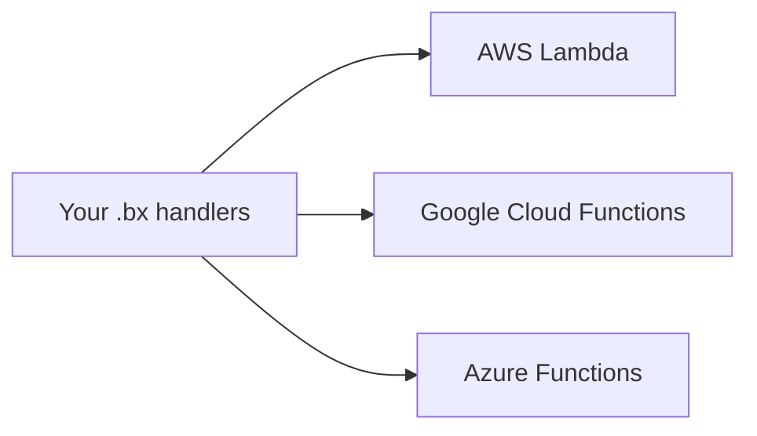

# 1.18.x

**BoxLang 1.18.0** is the first release shipped under our new positioning: **BoxLang is the AI-native software productivity platform for building, modernizing and running applications, with developers and AI agents working together.** This release delivers two headline features: a brand new **Azure Functions runtime** that completes the serverless trio with AWS Lambda and Google Cloud Functions, and **server fixation for scheduled tasks**, so a clustered deployment runs each task exactly once. It also hardens the AWS Lambda and Google Cloud Functions runtimes, adds a CLI that scripts and agents can drive, new class instantiation interception points, and a long list of CFML-compatibility and JDBC correctness fixes.


## ☁️ NEW: BoxLang Runs on Azure Functions

**BoxLang now has an official Azure Functions runtime.** Write BoxLang handlers once and run them on **AWS Lambda, Google Cloud Functions, and Microsoft Azure Functions** with the same `handlers/` routing, the same `manifest.json`, and the same `run( event, context, response )` contract. Read the [Azure Functions guide](../../getting-started/running-boxlang/azure-functions.md).



## 🧠 ALL BoxLang Skills Updated for 1.18

**Every BoxLang agent skill has been refreshed for this release.** All of the BoxLang developer, module, and core-development skills now carry the AI-native software productivity platform positioning, and the skills covering 1.18 behavior were updated with the new features:

* **Scheduled tasks:** server fixation (`.onOneServer()`), the `everyMonthOn()` clamp, and `boxlang schedule` reports.
* **CLI scripting and configuration:** `.boxlang.json` auto-discovery and `boxlang schedule --json`.
* **Interceptors (developer and core development):** the new `afterBoxClassCreation` and `afterBoxClassInit` interception points.
* **Async:** the `BoxFuture::allApply()` overload and async JDBC isolation.
* **Database access and CFML migration:** BIT handling, the `cflock` fix, and the new date setter functions.
* **Serverless:** the Azure Functions skill alongside refreshed AWS Lambda and Google Cloud Functions skills.

Install or update them all with one command, and browse them at [skills.boxlang.io](https://skills.boxlang.io):

```bash
npx skills add ortus-boxlang/skills
```

See [Skills and Guidelines](../../getting-started/agentic-development/skills-and-guidelines.md) for how agents use them.


**BoxLang 1.18.0 also includes every hotfix released since 1.17.0** (1.17.1 through 1.17.6). If you are on any 1.17.x patch, you already have those fixes. See [Included Hotfixes](#-included-hotfixes) for the full list.


**Tracking the AI-native platform story?** The documentation grew alongside this release: [Agentic Development](../../getting-started/agentic-development/README.md), the [BoxLang AI](../../boxlang-ai/README.md) section, [bx-playwright](../../boxlang-framework/modularity/playwright.md) browser automation, and [skills.boxlang.io](https://skills.boxlang.io). See [The AI-Native Platform](#-the-ai-native-platform) below.


## 🚀 Major Highlights

### ☁️ Azure Functions Runtime (BL-2107)

BoxLang is now a first-class citizen on **Microsoft Azure Functions**. Together with AWS Lambda and Google Cloud Functions, BoxLang now runs serverless on all three major clouds from one codebase.



What you get:

* **One handler contract everywhere.** `run( event, context, response )` is identical on AWS, Google and Azure, so your `.bx` code moves between providers unmodified.
* **Convention-based routing.** Handlers live in `handlers/`, a build-time `manifest.json` is the routing table, and the `x-bx-function` header selects a method.
* **A turnkey starter project** with Gradle dependency management, unit and integration testing, class compilation caching, configuration with environment overrides, the official Azure Functions Gradle plugin for local run and deploy, and GitHub Actions to test, build and release.
* **The full `Application.bx` lifecycle** with `onRequestStart`, `onRequestEnd`, `onError` and `onAbort` hooks, automatic request mapping to an `event` struct, logging and tracing, and automatic JSON response serialization.
* **Azure-aware defaults.** The runtime root comes from `BOXLANG_AZURE_ROOT` and falls back to the `AzureWebJobsScriptRoot` that the Azure host sets.

```js
// handlers/hello.bx
class {

    function run( event, context, response ) {
        return { message: "Hello from BoxLang on Azure" }
    }

}
```


[azure-functions.md](../../getting-started/running-boxlang/azure-functions.md)


### 🔒 Scheduled Tasks: Server Fixation for Clusters (BL-2653)

**Scheduled tasks are now cluster-safe.** Deploy the same `Scheduler.bx` to every node and, with one call, make sure each task runs on **exactly one server** per firing. Before 1.18, a task scheduled with `everyDayAt( "02:00" )` ran once **per node**, which is rarely what you want for nightly cleanups, report generation or cache warming.

```js
task( "nightly-cleanup" )
    .call( () => createObject( "MaintenanceService" ).cleanup() )
    .everyDayAt( "02:00" )
    .onOneServer()
```

How it works:

* **Distributed lock.** When a task is due, every node races to write a lock key into the scheduler's `cacheName` cache. The first write wins and runs the task; every other node skips that cycle.
* **Crash-safe.** The lock is left to expire instead of being released, so if the winning node dies mid-run, a surviving node can take the next scheduled run instead of the cluster being locked out.
* **Sized to the real schedule.** Lock lifetime is computed from the task's actual recurrence, including monthly and business-day constraints, not from the scheduler's short internal polling interval. A monthly task cannot be re-run the same day by a second node.
* **Observable.** After a run, `getStats()` includes `inetHost` and `localIp`, showing which server won.
* **Bring your own cache.** Point `cacheName` at a cache the servers share, such as Redis via `bx-redis`:

```json
{
    "scheduler": { "cacheName": "clusterLocks" },
    "caches": {
        "clusterLocks": {
            "provider": "Redis",
            "properties": { "host": "redis.internal.example.com", "port": "6379", "keyprefix": "boxlang-scheduler-locks" }
        }
    }
}
```


[scheduled-tasks.md](../../boxlang-framework/asynchronous-programming/scheduled-tasks.md)


The scheduler also got a reliability pass:

* [**BL-2654**](https://ortussolutions.atlassian.net/browse/BL-2654) - Fixed `.between()` combined with `.everyHour()` re-firing.
* [**BL-2534**](https://ortussolutions.atlassian.net/browse/BL-2534) - Fixed "A scheduler with the name [bxschedule] already exists".
* [**BL-2673**](https://ortussolutions.atlassian.net/browse/BL-2673) - Errors in a custom task failure function or `finally` block can no longer disable a scheduled task.
* [**BL-2700**](https://ortussolutions.atlassian.net/browse/BL-2700) - Fixed a concurrent modification exception in `schedule.doList()`.
* `everyMonthOn( 31 )` now clamps to the last day of shorter months instead of firing every day of that month.

### 🛡️ AWS Lambda and Google Cloud Functions Runtime Updates

The serverless runtimes share one hardened design across all three clouds:

* **Secure routing (BL-2711).** Only files under `handlers/`, or listed in the build-time `manifest.json`, are routable. Earlier runtimes routed to any `.bx` file at the project root, including `Application.bx` and `Lambda.bx`, which let an unauthenticated request reach lifecycle callbacks and other public methods through the `x-bx-function` header. Set `BOXLANG_ENABLE_ROOT_SCAN=false` to disable the legacy root-scan fallback entirely.
* **Lifecycle hooks receive the response.** `run()`, `onRequestStart`, `onRequestEnd`, `onError` and `onAbort` all receive the same `response` struct, so one `onRequestEnd` can wrap every result in a standard envelope and `onError` can shape errors. [**BL-2516**](https://ortussolutions.atlassian.net/browse/BL-2516) fixes AWS Lambda hooks having no access to the request and response.
* **Response modes.** `http` mode (default) pre-seeds `statusCode`, `headers`, `body` and `cookies`; `raw` mode returns your value as is. Set `BOXLANG_RESPONSE_MODE` to `http` or `raw`.
* **Handled errors.** An error handled by `onError` defaults the status to `500`, which you can change with `response.statusCode`.
* **Cleaner response object.** [**BL-2517**](https://ortussolutions.atlassian.net/browse/BL-2517) removes the extra properties from the pre-generated AWS Lambda response object.
* **Documented end to end.** New sections cover the `handlers/` convention, `manifest.json`, the application lifecycle, and the `GCLOUD_PROJECT` fallback for Google Cloud Functions.


[aws-lambda.md](../../getting-started/running-boxlang/aws-lambda.md)



[google-cloud-functions.md](../../getting-started/running-boxlang/google-cloud-functions.md)


### 🖥️ A CLI That Scripts and Agents Can Drive

* [**BL-2699**](https://ortussolutions.atlassian.net/browse/BL-2699) - **`.boxlang.json` auto-discovery.** The CLI runner now picks up a `.boxlang.json` in the current working directory when no config was supplied. An explicit `BOXLANG_CONFIG` environment variable or `--bx-config` flag always wins. See [Customizing boxlang.json](../../getting-started/running-boxlang/cli-scripting.md#customizing-boxlang-json) for the full lookup order, per-project and per-user files, and how it compares to `.env` files.
* [**BL-2652**](https://ortussolutions.atlassian.net/browse/BL-2652) / [**BL-1270**](https://ortussolutions.atlassian.net/browse/BL-1270) - **`boxlang schedule` reports.** Running `boxlang schedule` with no arguments now prints a report of scheduler configuration, loaded schedulers and their tasks, and persisted tasks instead of throwing. Add `--json` for a machine-readable document you can pipe into `jq` or hand to an agent. Credentials are stripped from the output.
* [**BL-2663**](https://ortussolutions.atlassian.net/browse/BL-2663) - `-h`, `--help` and `--version` no longer swallow a following module name, so `boxlang bxSites -h` routes to the module.
* [**BL-2701**](https://ortussolutions.atlassian.net/browse/BL-2701) - Clearer error when a module requested from the CLI is missing.

```bash
# Config discovered from ./.boxlang.json
boxlang script.bxs

# Scheduler report for humans and for tools
boxlang schedule
boxlang schedule --json | jq '.tasks'
```

### 🔌 New Interception Points: `afterBoxClassCreation` and `afterBoxClassInit` (BL-2705)

Two new interception points let interceptors observe BoxLang class instantiation:

| Point | Fires | Data |
| --- | --- | --- |
| `afterBoxClassCreation` | When an instance is fully defined (pseudo-constructor ran, interfaces and abstract methods validated) but **before** `init()`. Also fires for `noInit` creations such as `createObject()` and deserialization. Never fires for super classes in an `extends` chain. | `instance`, `className`, `noInit`, `context` |
| `afterBoxClassInit` | After `init()` (or the implicit constructor) completes. Does not fire for `noInit` creations or when `init()` throws. | `instance`, `result`, `className`, `context` |

These are the hooks for dependency injection, auditing, and observability layers.

### ✅ CFML Compatibility: `cflock type="exclusive"` Is Exclusive Again (BL-2686)

The CFML transpiler mapped `type="write"` to `exclusive`, then mapped every other value that was not `"readonly"` down to `"readonly"`, which caught `"exclusive"` itself. CFML-source locks written with `type="exclusive"` were silently compiled to **read locks**. That includes WireBox's `Singleton.cfc` double-checked locking, where the lock is the only protection against duplicate singleton construction under concurrency. This shipped in **1.17.6** and is included here. The mapping is now:

* `write` becomes `exclusive`
* `exclusive` (any case) stays `exclusive`
* `readonly` stays `readonly`
* anything else becomes `readonly` (CF's lenient default)

## 🤖 The AI-Native Platform

BoxLang is built for developers and the AI agents working beside them. The platform pieces below were documented and published alongside 1.18:

| Area | What it gives you | Docs |
| --- | --- | --- |
| **Agentic Development** | Set up your project, skills, MCP servers and IDE so an agent is productive from the first prompt. | [Agentic Development](../../getting-started/agentic-development/README.md) |
| **Fast validation** | `boxlang check` validates syntax without running code, so agents can verify every edit. | [Validate Your Code](../../getting-started/agentic-development/validate-your-code.md) |
| **Skills** | Installable `SKILL.md` playbooks for BoxLang, ColdBox, TestBox, CommandBox and modules. | [Skills and Guidelines](../../getting-started/agentic-development/skills-and-guidelines.md), [skills.boxlang.io](https://skills.boxlang.io) |
| **Docs over MCP** | Documentation is available to agents as MCP servers. | [BoxLang MCP](../../getting-started/agentic-development/boxlang-mcp.md) |
| **BoxLang AI** | Chat, agents, tools, memory, RAG, MCP, multimodal and governance through one fluent API. | [BoxLang AI](../../boxlang-ai/README.md) |
| **bx-playwright** | Fluent browser automation and testing, browser tools for AI agents, and HTML to PDF/image rendering. | [Playwright](../../boxlang-framework/modularity/playwright.md), [End to End with Playwright](../../getting-started/agentic-development/end-to-end-with-playwright.md) |
| **bx-search (BoxLang+)** | Full-text search with Elasticsearch, OpenSearch and Solr providers, CFML-compatible components, and a fluent `SearchNew()` BIF. | [Search +](../../boxlang-framework/boxlang-plus/modules/bx-search/README.md) |
| **Agentic web apps** | The fastest path to a BoxLang web application built with an agent. | [Agentic MVC](../../boxlang-framework/mvc.md), [Agentic Testing](../../boxlang-framework/testing.md) |

## ✨ New Features and Improvements

### Dates and Time (BL-2689)

Set a single unit of a date/time value without rebuilding it. Every unit is available as a `dateSet*()` BIF and as a member method; both mutate the date in place and return it.

```js
someDate = now()

// Member method syntax
someDate.setYear( 2027 )
someDate.setMonth( 6 )
someDate.setDay( 15 )

// Equivalent BIF syntax
someDate = dateSetHour( someDate, 14 )
someDate = dateSetMinute( someDate, 30 )
```

Out-of-range values roll over into the next unit (`setDay( 50 )` advances into following months), while zero or negative values clamp to the first valid unit (`setDay( 0 )` becomes day `1`). Reference: [dateSetYear](../../boxlang-language/reference/built-in-functions/temporal/dateSetYear.md), [dateSetMonth](../../boxlang-language/reference/built-in-functions/temporal/dateSetMonth.md), [dateSetDay](../../boxlang-language/reference/built-in-functions/temporal/dateSetDay.md), [dateSetHour](../../boxlang-language/reference/built-in-functions/temporal/dateSetHour.md), [dateSetMinute](../../boxlang-language/reference/built-in-functions/temporal/dateSetMinute.md), [dateSetSecond](../../boxlang-language/reference/built-in-functions/temporal/dateSetSecond.md).

### Async

* [**BL-2685**](https://ortussolutions.atlassian.net/browse/BL-2685) - `BoxFuture.allApply()` has an overload that does not require an error handler: `BoxFuture::allApply( myArray, ( item ) => processItem( item ) )`.
* [**BL-2659**](https://ortussolutions.atlassian.net/browse/BL-2659) - `runAsync()`, `asyncAll()` and `asyncAllApply()` now isolate their JDBC connection and transaction instead of sharing the caller's.
* [**BL-2696**](https://ortussolutions.atlassian.net/browse/BL-2696) - `bx:thread` metadata (`status`, `elapsedTime`, `stackTrace`) is computed on read instead of tracked continuously. A stack trace is expensive to capture and was previously paid on every unscoped variable lookup inside a thread.
* [**BL-2681**](https://ortussolutions.atlassian.net/browse/BL-2681) - Fixed a `RequestThreadManager` completion race that could cause an infinite CPU spin.

### JDBC and Queries

* [**BLMODULES-300**](https://ortussolutions.atlassian.net/browse/BLMODULES-300) - New global `GenericJDBCDriver.representBitAsBoolean` flag (default `false`). When enabled from Java code or a module, `BIT` values in query objects are true booleans instead of `1`/`0`. There is no `boxlang.json` setting for it yet. Builds on the bit-casting consistency fix [BL-2674](https://ortussolutions.atlassian.net/browse/BL-2674) from 1.17.4.
* [**BL-2661**](https://ortussolutions.atlassian.net/browse/BL-2661) - HikariCP upgraded to 7.1.0.
* [**BL-2676**](https://ortussolutions.atlassian.net/browse/BL-2676) - JDBC parameter `scale` and `maxLength` accept valid numeric values that are not Java Integers.
* [**BL-2690**](https://ortussolutions.atlassian.net/browse/BL-2690) - Non-bit columns no longer attempt a failing cast to boolean.
* [**BL-2691**](https://ortussolutions.atlassian.net/browse/BL-2691) - Date detection for query params recognizes any Java date/time type; fixed a column type lookup bug with duplicate column labels.
* [**BL-2679**](https://ortussolutions.atlassian.net/browse/BL-2679) - Improved proc debugging.

### Language and Runtime

* [**BL-2675**](https://ortussolutions.atlassian.net/browse/BL-2675) - The `param` statement now evaluates its default expression only when the variable does not already exist.
* [**BL-2628**](https://ortussolutions.atlassian.net/browse/BL-2628) - Property merging from a parent class happens exactly once per class, even when two threads instantiate a freshly compiled subclass at the same moment. Fixes missing generated accessors.
* [**BL-2457**](https://ortussolutions.atlassian.net/browse/BL-2457) - Fixed nested `switch` statements returning incorrect values.
* [**BL-2649**](https://ortussolutions.atlassian.net/browse/BL-2649) - `array.toSet( "linked" )` preserves the original array order.
* [**BL-2523**](https://ortussolutions.atlassian.net/browse/BL-2523) - `structFindKey()` descends into arrays.
* [**BL-2688**](https://ortussolutions.atlassian.net/browse/BL-2688) - Internal boxpiler build refactor.

### Performance

* [**BL-2697**](https://ortussolutions.atlassian.net/browse/BL-2697) - `replace( ..., "all" )` exits early when the substring never appears and avoids repeated allocation.
* [**BL-2666**](https://ortussolutions.atlassian.net/browse/BL-2666) / [**BL-2671**](https://ortussolutions.atlassian.net/browse/BL-2671) - `listAppend()` performance with `includeEmptyFields=false`, plus a regression fix.
* [**BL-2670**](https://ortussolutions.atlassian.net/browse/BL-2670) - `isDate()` is faster on non-dates.

### Web, Sessions and Files

* [**BL-2709**](https://ortussolutions.atlassian.net/browse/BL-2709) - `application action="update"` keeps the request's live session instead of swapping in the cached copy, which lost writes with serializing session stores such as Redis.
* [**BL-2664**](https://ortussolutions.atlassian.net/browse/BL-2664) - Session persistence no longer runs after a redirect has already been sent.
* [**BL-2682**](https://ortussolutions.atlassian.net/browse/BL-2682) - Fixed whitespace compression corrupting SSE responses.
* [**BL-2662**](https://ortussolutions.atlassian.net/browse/BL-2662) - Whitespace management no longer strips the LF from CRLF.
* [**BL-2651**](https://ortussolutions.atlassian.net/browse/BL-2651) - `?&` no longer produces an empty URL variable.
* [**BL-2656**](https://ortussolutions.atlassian.net/browse/BL-2656) - Included template URLs are trimmed.
* [**BL-2703**](https://ortussolutions.atlassian.net/browse/BL-2703) - `FileUpload` no longer fails on an empty `Optional`.
* [**BL-2683**](https://ortussolutions.atlassian.net/browse/BL-2683) - File reads (`BoxFile`, `fileRead()`, `loop file=...`) no longer stop at the first byte sequence invalid for the charset.

### CFML Compatibility

* [**BL-2686**](https://ortussolutions.atlassian.net/browse/BL-2686) - See [Major Highlights](#-major-highlights).
* [**BL-2684**](https://ortussolutions.atlassian.net/browse/BL-2684) - `bx:transaction` / `cftransaction`: exact `action="begin"` detection, corrected commit/rollback/cleanup order, and `commit`, `rollback` and `setsavepoint` no-op when no transaction is active.
* [**BL-2693**](https://ortussolutions.atlassian.net/browse/BL-2693) / [**BL-2694**](https://ortussolutions.atlassian.net/browse/BL-2694) / [**BL-2678**](https://ortussolutions.atlassian.net/browse/BL-2678) - `numberFormat()` / `lsNumberFormat()` rounding, locale, default mask, left-padding and trailing-zero behavior aligned with Adobe CF and Lucee.
* [**BL-2713**](https://ortussolutions.atlassian.net/browse/BL-2713) - BigDecimal and BigInteger casters ignore leading zeros.
* [**BL-2657**](https://ortussolutions.atlassian.net/browse/BL-2657) - `parseDateTime( "2/5/2026 12:00:00 AM" )` parses.
* [**BL-2658**](https://ortussolutions.atlassian.net/browse/BL-2658) - `structGet()` unwraps query columns.
* [**BL-2660**](https://ortussolutions.atlassian.net/browse/BL-2660) - Additional CF compatibility for XML features.
* [**BL-2665**](https://ortussolutions.atlassian.net/browse/BL-2665) - Query nulls serialize to JSON as empty strings, as Adobe does.
* [**BL-2593**](https://ortussolutions.atlassian.net/browse/BL-2593) - UU encoding and decoding handle strings and byte arrays correctly.
* [**BL-2702**](https://ortussolutions.atlassian.net/browse/BL-2702) - `listEach()` passes the original list string as the third closure argument, not an array.
* [**BL-2569**](https://ortussolutions.atlassian.net/browse/BL-2569) - Java exception `message` is an empty string rather than null.

### Modules

* **bx-mail** - [BL-2708](https://ortussolutions.atlassian.net/browse/BL-2708): multipart mail structure and charset handling when `charset=utf-8` is set.
* **bx-spreadsheet** - [BL-2668](https://ortussolutions.atlassian.net/browse/BL-2668): `SpreadsheetAddRow()` retains empty list elements.
* **bx-plus** - [BL-2669](https://ortussolutions.atlassian.net/browse/BL-2669): no longer requires the `.seed` file to exist.

## 🩹 Included Hotfixes

BoxLang 1.18.0 contains all of the following patch releases. Full details are on the [1.17.x page](1.17.0.md#patch-releases).

| Patch | Released | Fixes |
| --- | --- | --- |
| [1.17.1](1.17.0.md#patch-releases) | 9/1/2026 | BL-2657, BL-2658 |
| [1.17.2](1.17.0.md#patch-releases) | 9/3/2026 | BL-2664 |
| [1.17.3](1.17.0.md#patch-releases) | 9/5/2026 | BL-2665, BL-2666, BL-2667 |
| [1.17.4](1.17.0.md#patch-releases) | 9/11/2026 | BL-2669, BL-2670, BL-2671, BL-2672, BL-2674, BL-2677, BL-2678 |
| [1.17.5](1.17.0.md#patch-releases) | 9/14/2026 | BL-2687 |
| [1.17.6](1.17.0.md#patch-releases) | 9/25/2026 | BL-2683, BL-2684, BL-2686, BL-2691, BL-2692, BL-2693, BL-2694, BL-2697, BL-2704 |

## ⚡ Migration Notes

* **`cflock type="exclusive"` is now actually exclusive.** CF-transpiled code (and libraries such as WireBox's singleton scope) that relies on `type="exclusive"` now blocks concurrent access. If anything depended on the old behavior, re-verify under load; you may see more lock contention.
* **Invalid characters no longer truncate a file read.** Code that relied on reads stopping at the first byte sequence invalid for the charset will now continue with the Unicode replacement character substituted.
* **The CLI now reads `./.boxlang.json`.** If a `.boxlang.json` sits in the directory you run `boxlang` from, it is now loaded. Set `BOXLANG_CONFIG` or `--bx-config` to override it.
* **`application action="update"` keeps the live session.** Session writes made during the request are no longer lost with serializing session stores.
* **`param` defaults are lazy.** The default expression is no longer evaluated when the variable already exists. Defaults with side effects will no longer run in that case.

## 📊 Release Snapshot

* **Release Date:** October 2, 2026
* **Status:** Released
* **Total Issues:** 67
* **Distribution:** 8 New Features, 15 Improvements, 43 Bugs, 1 Task
* **Primary Focus:** Azure Functions runtime, scheduler server fixation, Lambda and Google runtime hardening, CLI automation, class instantiation interception points, CFML and JDBC correctness, and the AI-native platform story

## 🎶 Release Notes

* [BL-1270](https://ortussolutions.atlassian.net/browse/BL-1270) - boxlang schedule should return usage info
* [BL-2107](https://ortussolutions.atlassian.net/browse/BL-2107) - Create the Azure Functions Runtime Plan
* [BL-2457](https://ortussolutions.atlassian.net/browse/BL-2457) - Nested switch statements returning incorrect values
* [BL-2516](https://ortussolutions.atlassian.net/browse/BL-2516) - AWS Lambda - no access to request and response in Application.cfc methods
* [BL-2517](https://ortussolutions.atlassian.net/browse/BL-2517) - AWS Lambda - pre-generated response object has too many properties
* [BL-2523](https://ortussolutions.atlassian.net/browse/BL-2523) - StructFindKey Not Returning Items in Array
* [BL-2534](https://ortussolutions.atlassian.net/browse/BL-2534) - A scheduler with the name [bxschedule] already exists
* [BL-2569](https://ortussolutions.atlassian.net/browse/BL-2569) - Compat: Java Exception `message` object is null vs empty string
* [BL-2593](https://ortussolutions.atlassian.net/browse/BL-2593) - UU Encoding/Decoding Not Correctly Handling Strings and Byte Arrays
* [BL-2628](https://ortussolutions.atlassian.net/browse/BL-2628) - generated accessors missing when a freshly compiled subclass is instantiated in parallel
* [BL-2649](https://ortussolutions.atlassian.net/browse/BL-2649) - array.toSet( "linked" ) loses original array order
* [BL-2651](https://ortussolutions.atlassian.net/browse/BL-2651) - ?& causes empty url var
* [BL-2652](https://ortussolutions.atlassian.net/browse/BL-2652) - boxlang schedule: print a scheduler/tasks report (text or --json) when run with no scheduler file
* [BL-2653](https://ortussolutions.atlassian.net/browse/BL-2653) - Server fixation / DELAY issue
* [BL-2654](https://ortussolutions.atlassian.net/browse/BL-2654) - .between() + .everyHour() re-fire issue
* [BL-2656](https://ortussolutions.atlassian.net/browse/BL-2656) - Trim included template URL
* [BL-2657](https://ortussolutions.atlassian.net/browse/BL-2657) - Compat: parseDateTime( "2/5/2026 12:00:00 AM" ) fails
* [BL-2658](https://ortussolutions.atlassian.net/browse/BL-2658) - structGet() doesn't unwrap query column
* [BL-2659](https://ortussolutions.atlassian.net/browse/BL-2659) - runAsync does not get a fresh database connection
* [BL-2660](https://ortussolutions.atlassian.net/browse/BL-2660) - Missing CF compat for XML Features
* [BL-2661](https://ortussolutions.atlassian.net/browse/BL-2661) - Upgrade HikariCP to 7.1.0
* [BL-2662](https://ortussolutions.atlassian.net/browse/BL-2662) - Whitespace managment stripping the LF from CRLF
* [BL-2663](https://ortussolutions.atlassian.net/browse/BL-2663) - CLI: `-h`/`--help`/`--version` swallow a following module name instead of routing to it (e.g. `boxlang bxSites -h`)
* [BL-2664](https://ortussolutions.atlassian.net/browse/BL-2664) - Session persistence runs after redirects have been sent to browser
* [BL-2665](https://ortussolutions.atlassian.net/browse/BL-2665) - Adobe doesn't convert query nulls to empty string on JSON serialization
* [BL-2666](https://ortussolutions.atlassian.net/browse/BL-2666) - Improve listAppend() performance when includeEmptyFields=false
* [BL-2667](https://ortussolutions.atlassian.net/browse/BL-2667) - file component action="write" is supposed to default relative paths to tmp dir
* [BL-2668](https://ortussolutions.atlassian.net/browse/BL-2668) - SpreadsheetAddRow() needs to retain empty list elements
* [BL-2669](https://ortussolutions.atlassian.net/browse/BL-2669) - bx-plus currently needs the .seed file to always exist
* [BL-2670](https://ortussolutions.atlassian.net/browse/BL-2670) - improve isDate() performance on non-dates
* [BL-2671](https://ortussolutions.atlassian.net/browse/BL-2671) - listAppend() regression
* [BL-2672](https://ortussolutions.atlassian.net/browse/BL-2672) - Guard against exception cause circular reference
* [BL-2673](https://ortussolutions.atlassian.net/browse/BL-2673) - Errors in custom task failure function or in finally block can disable scheduled task
* [BL-2674](https://ortussolutions.atlassian.net/browse/BL-2674) - Bit columns across databases are not consistently cast
* [BL-2675](https://ortussolutions.atlassian.net/browse/BL-2675) - Param statement evaluates its default expression when the variable already exists
* [BL-2676](https://ortussolutions.atlassian.net/browse/BL-2676) - JDBC parameter scale and maxLength reject valid numeric values that are not Java Integers
* [BL-2677](https://ortussolutions.atlassian.net/browse/BL-2677) - clob/blob values manually added to query incorrect
* [BL-2678](https://ortussolutions.atlassian.net/browse/BL-2678) - .__ in number format not forcing trailing zeros
* [BL-2679](https://ortussolutions.atlassian.net/browse/BL-2679) - Improve proc debugging
* [BL-2681](https://ortussolutions.atlassian.net/browse/BL-2681) - RequestThreadManager completion race causes an infinite CPU spin
* [BL-2682](https://ortussolutions.atlassian.net/browse/BL-2682) - Whitespace compression corrupts SSE responses; no per-application override
* [BL-2683](https://ortussolutions.atlassian.net/browse/BL-2683) - loop over file fails with invalid bytes
* [BL-2684](https://ortussolutions.atlassian.net/browse/BL-2684) - Better transaction CF compat
* [BL-2685](https://ortussolutions.atlassian.net/browse/BL-2685) - Add an allApply() to the BoxFuture() that doesn't require an error handler
* [BL-2686](https://ortussolutions.atlassian.net/browse/BL-2686) - clock race condition
* [BL-2687](https://ortussolutions.atlassian.net/browse/BL-2687) - restore JSON interception announcement
* [BL-2688](https://ortussolutions.atlassian.net/browse/BL-2688) - Refactor boxpiler build
* [BL-2689](https://ortussolutions.atlassian.net/browse/BL-2689) - Compat:  New Date Member Functions and BIFs
* [BL-2690](https://ortussolutions.atlassian.net/browse/BL-2690) - Non-bit columns can sometimes attempt a failing cast to boolean
* [BL-2691](https://ortussolutions.atlassian.net/browse/BL-2691) - TimeStamp not being recognized as a date in query param
* [BL-2692](https://ortussolutions.atlassian.net/browse/BL-2692) - Off-by-one error when transforming query column values
* [BL-2693](https://ortussolutions.atlassian.net/browse/BL-2693) - numberFormat() / lsNumberFormat(): rounding, request locale and default mask differ from Lucee / Adobe CF
* [BL-2694](https://ortussolutions.atlassian.net/browse/BL-2694) - numberFormat(): result is not left-padded to the width of the mask (Adobe CF and Lucee both pad)
* [BL-2696](https://ortussolutions.atlassian.net/browse/BL-2696) - ThreadComponentBoxContext.scopeFind captures a full Java stack trace on every scope lookup inside a thread body
* [BL-2697](https://ortussolutions.atlassian.net/browse/BL-2697) - improve performance of replace()
* [BL-2699](https://ortussolutions.atlassian.net/browse/BL-2699) - CLI: Auto-discover .boxlang.json config file in the current working directory
* [BL-2700](https://ortussolutions.atlassian.net/browse/BL-2700) - Concurrent modification exception in schedule.doList()
* [BL-2701](https://ortussolutions.atlassian.net/browse/BL-2701) - Better error when missing module from CLI
* [BL-2702](https://ortussolutions.atlassian.net/browse/BL-2702) - ListEach - Third Argument of the original string list is an array
* [BL-2703](https://ortussolutions.atlassian.net/browse/BL-2703) - FileUpload.java calls Optional<String>.get() on empty Optional
* [BL-2704](https://ortussolutions.atlassian.net/browse/BL-2704) - Floating point issue with queryparam
* [BL-2705](https://ortussolutions.atlassian.net/browse/BL-2705) - New interception points: afterBoxClassCreation and afterBoxClassInit for BoxLang class instantiation
* [BL-2708](https://ortussolutions.atlassian.net/browse/BL-2708) - bx-mail: multipart mails are built as `multipart/mixed` with mislabelled parts and ISO-8859-1 bodies although `charset=utf-8` is set
* [BL-2709](https://ortussolutions.atlassian.net/browse/BL-2709) - application action="update" swaps the request's session for the cached copy with a serializing session store (Redis): session writes lost, onSessionStart fires twice
* [BL-2711](https://ortussolutions.atlassian.net/browse/BL-2711) - Security: restrict Lambda/GCF URI routing to registered handlers
* [BL-2713](https://ortussolutions.atlassian.net/browse/BL-2713) - BigDecimal and BigInteger caster don't ignore leading zeros
* [BLMODULES-300](https://ortussolutions.atlassian.net/browse/BLMODULES-300) - Allow opt-in to represent query bit as boolean or int
