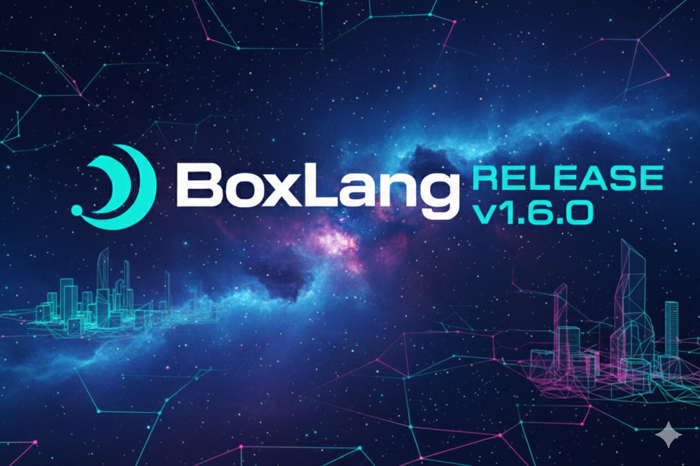
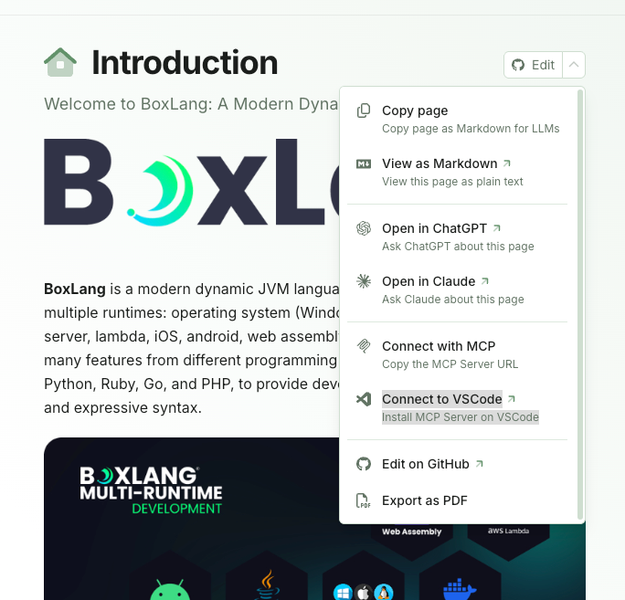

# 1.6.0

<figure><figcaption></figcaption></figure>


BoxLang 1.6.0 brings significant performance improvements, enhanced async capabilities with advanced executor monitoring, improved REPL/MiniConsole framework, and better module mapping support. This release focuses on optimization, developer experience, and compatibility enhancements.


### 🚀 Major Highlights

### 📚 BoxLang Documentation MCP Server

<figure><figcaption></figcaption></figure>


BoxLang documentation is now accessible via the **Model Context Protocol (MCP)**! Connect AI assistants like Claude, GitHub Copilot, and other MCP-compatible tools directly to the comprehensive BoxLang documentation for instant access to language references, framework features, and best practices.

**Connect to the MCP Server:**

* **Direct MCP URL**: `https://boxlang.ortusbooks.com/~gitbook/mcp`
* **One-Click VSCode Installation**: [Install BoxLang MCP Server](vscode:mcp/install?%7B%22name%22%3A%22BoxLang%20%3A%20A%20Modern%20Dynamic%20JVM%20Language%22%2C%22url%22%3A%22https%3A%2F%2Fboxlang.ortusbooks.com%2F~gitbook%2Fmcp%22%7D)

This enables developers to:

* 🔍 Search BoxLang documentation semantically from within AI assistants
* 💡 Get instant answers about BIFs, components, and framework features
* 📖 Access code examples and best practices without leaving your workflow
* 🤖 Enhance AI-assisted BoxLang development with authoritative documentation

### Enhanced BoxExecutor with Health Monitoring & Statistics

The `ExecutorRecord` has been transformed into a full-fledged `BoxExecutor` class with comprehensive health monitoring, activity tracking, and advanced statistics. This provides deep insights into your async operations.

You can now retrieve detailed stats and health information about your executors. The following are the different status strings you can expect:

* `healthy` - Executor is operating normally within defined thresholds.
* `degraded` - Executor is experiencing some issues but is still functional. May indicate high load or minor problems.
* `critical` - Executor is in a critical state and may not be functioning properly. Immediate attention is required.
* `idle` - Executor has no active tasks and is idle.
* `shutdown` - Executor is in the process of shutting down and will not accept new tasks.
* `terminated` - Executor has been terminated and is no longer operational.
* `draining` - Executor is finishing existing tasks but not accepting new ones.

The new Executor Health Report provides a detailed analysis of the executor's health, including detected issues, recommendations for improvement, alerts for critical conditions, and insights into performance trends. The result is a structure containing the following keys:

* `status` - Overall health status of the executor.
* `summary` - A brief summary of the executor's health.
* `issues` - An array of detected issues affecting the executor's health.
* `recommendations` - An array of recommended actions to improve executor health.
* `alerts` - An array of critical alerts that require immediate attention.
* `insights` - An array of insights into executor performance and trends.
* `lastChecked` - Timestamp of the last health check.

```js
// Get executor and check its comprehensive stats including health
executor = asyncService.getExecutor( "myExecutor" )
stats = executor.getStats()

// Returns detailed metrics including:
// - Basic info: name, type, created, uptime, lastActivity
// - Task metrics: taskSubmissionCount, taskCount, completedTaskCount, activeCount
// - Pool metrics: poolSize, corePoolSize, maximumPoolSize, largestPoolSize
// - Queue metrics: queueSize, queueCapacity, queueUtilization
// - Utilization: poolUtilization, threadsUtilization, taskCompletionRate
// - Health status: healthStatus ("healthy", "degraded", "critical", "idle", etc.)
// - Health report: detailed analysis with issues, recommendations, alerts, insights

// Check if executor is healthy (simple boolean check)
isHealthy = executor.isHealthy()  // returns true/false

// Access health information from stats
healthStatus = stats.healthStatus  // "healthy", "degraded", "critical", "idle", "shutdown", "terminated", "draining"
healthReport = stats.healthReport  // Detailed health analysis

// Health report includes:
// - status: overall health status
// - summary: brief description
// - issues: array of detected problems
// - recommendations: array of suggested actions
// - alerts: array of critical alerts
// - insights: array of performance insights
```

This opens the door for our future tooling around executor management and monitoring.

### MiniConsole Framework & REPL Improvements

A new `MiniConsole` framework has been introduced, bringing sophisticated terminal interaction capabilities and dramatically improved REPL experience with:

* **Syntax highlighting** for BoxLang code with color themes (dark/light palettes)
* **Tab completion** for BIFs and components with intelligent providers
* **Cross-platform key handling** (Windows, macOS, Linux)
* **Multi-line editing** with continuation prompts
* **Command history** with shortcuts (`!!`, `!n`)
* **Color printing utilities** for rich terminal output
* **Much More**

```js
// REPL now includes smart syntax highlighting
📦 BoxLang> arrayMap( [1,2,3], (x) => x * 2 )
// BIFs in bright green, functions in purple

// Tab completion for components and BIFs
� BoxLang> array<TAB>
// Shows: arrayMap, arrayFilter, arrayEach, arrayReduce...
```

### Module Public Mapping Support

Modules have now a new mapping by convention called `publicMapping` that allows you to define a public mapping for your module's assets. This is in addition to the existing `mapping` property which is used for internal module paths and not visible outside the module. The `publicMapping` can be defined as a simple string or a struct for advanced configuration.

```js
// In ModuleConfig.bx
component {
    // Simple string - creates /bxModules/{moduleName}/public mapping
    this.publicMapping = "public"

    // Or use a struct for advanced config
    this.publicMapping = {
        name: "assets",
        path: "resources/public",
        usePrefix: true,
        external: true
    }

    // Enhanced this.mapping also supports structs
    this.mapping = {
        name: "myModule",
        path: "models",
        usePrefix: false
    }
}
```

## 🤖 Core Runtime Updates

### Performance Optimizations

We have done a second round of performance optimizations focusing on reducing thread contention, memory usage, and improving throughput. Key improvements include:

* **Deferred interception data creation** based on `hasState()` checks, which have increased throughput by over 50x
* **Removed synchronized modifiers** on singleton `getInstance()` methods, improving concurrency and dramatically reducing thread contention
* **Non-concurrent maps** for context config and other internal data structures (reduced thread contention dramatically)
* **Weak reference disk class caching** for better memory management, 80% reduction in memory usage in some scenarios
* **Cached Application descriptor lookups** when trusted cache is enabled
* **Overloaded internal `expandPath()` method** for known mappings to avoid `context.getConfig()` calls
* **ASM compiler improvements** to avoid method-level synchronization in `getInstance()` patterns

These performance improvements can lead to significant speedups in high-concurrency environments and reduce memory footprint considerably. Compilation and execution times are becoming instant in some scenarios. This is a significant jump in performance for BoxLang. We have updated our TechEmpower benchmarks to include BoxLang and how it compares to Adobe and Lucee using vanilla code and also ColdBox. We will be releasing the results soon and will always be available publicly.

We have seen performance and throughput improvements ranging from 45-65% in various benchmarks and vanilla ColdBox applications, between `1.6` and previous `1.5.x` releases. Using BoxLang and our SocketBox websocket's library and server we have seen capabilities of over 5,000 concurrent websocket connections running smoothly on a modest development machine.

#### Performance Stats

* Plain text and updates tests increased from 23,000 requests per second to over 53,000 requests per second on modest cloud VM
* SQL queries tests jumped from 15k requests per second to over 18k requests per second
* 5,000 concurrent websocket connections on a dev laptop with 256 MB of memory allocated to the JVM (Windows, Linux would be higher)
  * CPU once they were all connected and sending 500 heartbeat req/sec was only 4-5%
  * This test pushed 55,000 requests to the server in \~1 minute with an average processing time of 24ms and 0 errors
  * Total heap used never went past 190 MB during the test

More coming soon.

### DateTime Enhancements

* **Immutability flag** to prevent timezone mutation during formatting
* **Performance optimizations** for DateTime class operations
* **Improved date parsing** with better mask support (`yyyy/M/d`)
* **Two-digit year handling** always assumes current millennium
* **Consistent default formats** between parsed date results
* **DateFormat BIF compatibility** - all `m` letters treated as `M`

### JDBC & Database

* **Disabled connection leak detection by default** for better performance
* **Fixed NPE in bx-mariadb** when checking DDL statement results
* **Improved query param encoding** in HTTP requests

## 📡 MiniServer Runtime Updates

### Enhanced Error Handling

* **Improved exception handling** when invalid arguments are provided
* **STOMP heartbeat responses** now properly returned from miniserver
* **Version flag support** - `boxlang-miniserver --version` displays version information

## 🤖 Servlet Runtime Updates

### Jakarta EE Compliance

* **Updated web.xml to Jakarta specs** with proper namespace declarations
* **Integration tests added** to verify WAR deployment can expand, deploy, and run BoxLang code successfully
* **Fixed file upload handling** for small files in servlet environment

## 🚀 AWS Lambda Runtime Updates

* **Upgraded AWS Lambda Java Core** from 1.3.0 to 1.4.0

## 🛠️ Developer Experience

### BIF & Component Documentation

Built-in functions and components now include runtime descriptions via the `description` attribute in `@BoxBIF` and `@BoxComponent` annotations:

```java
@BoxBIF(
    description = "Returns the length of a string, array, struct, or query"
)
public class Len extends BIF {
    // ...
}

@BoxComponent(
    name = "Http",
    description = "Makes HTTP/HTTPS requests to remote servers"
)
public class Http extends Component {
    // ...
}
```

### CFTranspile Improvements

* **Verbose mode added** to `cftranspile` command for detailed conversion insights
* Better visibility into transpilation issues and potential data concerns

### Feature Audit Tool

* **Updated feature audit** with improved output
* **Lists missing modules** to help identify required BoxLang modules for migrations

## 🐛 Notable Bug Fixes

### Component & Function Fixes

* **`structKeyExists()` now works on closures**
* **`imageRead()`** properly expands paths and handles URIs
* **`bx:cookie` expires attribute** now processes dates before strings
* **HTTP component** now returns results when both `file` and `path` are specified
* **File/Path compatibility** improved between BoxLang, Lucee, and Adobe CF

### XML Handling

* **`XMLElemNew()` usage** - XMLAttribute on produced nodes no longer throws errors
* **Empty `xmlNew()` results** now produce valid XML objects with nodes
* **Multiple BOMs** - parsing no longer fails on files with multiple byte order marks

### Parsing Improvements

* **Extra spaces in tag close** now parse correctly
* **`return` keyword** can now be used as a variable name
* **`component` keyword** can be used as annotation name
* **FQN starting with underscore** now supported
* **Property shortcuts with FQN types** now work properly

### List & Compatibility Fixes

* **`ListDeleteAt()` retains leading delimiters** in compatibility mode
* **CF compat nulls** now equal empty strings
* **`IsValid()` supports `number` type** in compatibility mode
* **Lucee JSON compatibility** - unquoted keys in JSON handled consistently with Lucee when in compatibility mode
* **Duplication util** now uses correct class loader when serializing classes

## 🔧 Configuration Updates

### Datasource Environment Variables

* **Datasource keys** are now searched for environment variable replacements in configuration
* Supports patterns like `${DB_HOST}`, `${DB_PORT}` in datasource definitions

### Mapping Configuration

* **Enhanced mapping registration** detects between simple and complex mappings
* Better handling of module mappings with `usePrefix` and external flags

## ⚡ Migration Notes

### Breaking Changes

None registered for this release.

### Compatibility Improvements

This release includes numerous compatibility fixes for Adobe ColdFusion and Lucee migrations:

* DateFormat mask handling (`m` vs `M`)
* ListDeleteAt delimiter behavior
* Null handling in CF compat mode
* IsValid type validation
* JSON unquoted key handling

### Performance Considerations

* **JDBC connection leak detection** is now disabled by default. Enable via configuration if needed for debugging
* **Trusted cache behavior** - Application descriptor lookups are now cached when trusted cache is enabled
* Consider using the new **BoxExecutor health monitoring** to track async operation performance

## 🎶 Release Notes

### Improvements

[BL-1591](https://ortussolutions.atlassian.net/browse/BL-1591) Update the feature audit tool - Part 2

[BL-1735](https://ortussolutions.atlassian.net/browse/BL-1735) Bad link on dateformat in docs

[BL-1741](https://ortussolutions.atlassian.net/browse/BL-1741) Performance optimizations for DateTime class

[BL-1742](https://ortussolutions.atlassian.net/browse/BL-1742) HTTP Param - Change URL param handling to Encode Always

[BL-1747](https://ortussolutions.atlassian.net/browse/BL-1747) defer intercept data creation based on hasState()

[BL-1748](https://ortussolutions.atlassian.net/browse/BL-1748) avoid synchronized modifier on singleton getInstance() methods

[BL-1749](https://ortussolutions.atlassian.net/browse/BL-1749) Convert context config to non-concurrent maps for performance

[BL-1750](https://ortussolutions.atlassian.net/browse/BL-1750) assorted small performance fixes

[BL-1752](https://ortussolutions.atlassian.net/browse/BL-1752) Disable JDBC connection leak detection by default

[BL-1753](https://ortussolutions.atlassian.net/browse/BL-1753) Add weak reference disk class caching

[BL-1754](https://ortussolutions.atlassian.net/browse/BL-1754) Cache Application descriptor lookups when trusted cache is enabled

[BL-1755](https://ortussolutions.atlassian.net/browse/BL-1755) Provide overloaded internal expandpath method for known mappings to avoid context.getConfig()

[BL-1758](https://ortussolutions.atlassian.net/browse/BL-1758) bx:cookie did not try to process \`expires\` as a date before a string

[BL-1765](https://ortussolutions.atlassian.net/browse/BL-1765) Improve exception handling on miniserver when arguments are invalid

[BL-1767](https://ortussolutions.atlassian.net/browse/BL-1767) Added verbose mode to the cftranspile command to see issues or potential data

[BL-1775](https://ortussolutions.atlassian.net/browse/BL-1775) calling getCachedObjectMetadata registers as a hit

[BL-1785](https://ortussolutions.atlassian.net/browse/BL-1785) Improve type names in error messages

[BL-1786](https://ortussolutions.atlassian.net/browse/BL-1786) modify getInstance pattern in ASM compiler to avoid method-level synchronization

[BL-1793](https://ortussolutions.atlassian.net/browse/BL-1793) Configuration mappings registration needs to be updated to detect between a simple and a complex mapping

[BL-1794](https://ortussolutions.atlassian.net/browse/BL-1794) Add \`context\` to intercept data whenever you can find interception calls that require it

[BL-1795](https://ortussolutions.atlassian.net/browse/BL-1795) The key to the datasource needs to be searched for env replacements in the configuraiton

[BL-1802](https://ortussolutions.atlassian.net/browse/BL-1802) Update feature audit to output list of missing modules

[BL-1805](https://ortussolutions.atlassian.net/browse/BL-1805) return STOMP heartbeat responses from miniserver

### Bugs

[BL-1586](https://ortussolutions.atlassian.net/browse/BL-1586) ImageRead does not expand the path

[BL-1672](https://ortussolutions.atlassian.net/browse/BL-1672) imageRead with URIs

[BL-1690](https://ortussolutions.atlassian.net/browse/BL-1690) When using compatibility mode and set to Lucee, handling of unquoted keys in json is not consistent with Lucee.

[BL-1695](https://ortussolutions.atlassian.net/browse/BL-1695) duplication util doesn't use correct class loader when serializing classes

[BL-1710](https://ortussolutions.atlassian.net/browse/BL-1710) Cannot use structKeyExists on closure

[BL-1727](https://ortussolutions.atlassian.net/browse/BL-1727) small files not uploaded in servlet

[BL-1729](https://ortussolutions.atlassian.net/browse/BL-1729) Compare Operations Should Not Use Collations unless Locale Sensitivity is Specified

[BL-1731](https://ortussolutions.atlassian.net/browse/BL-1731) Change Deprecated Uses of StringUtils compare and contains functions to use new Strings API

[BL-1732](https://ortussolutions.atlassian.net/browse/BL-1732) number caster doesn't trim spaces on incoming strings

[BL-1736](https://ortussolutions.atlassian.net/browse/BL-1736) Native toString output of ZonedDateTime object not being parsed/cast correctly

[BL-1737](https://ortussolutions.atlassian.net/browse/BL-1737) HTTP Component not returning result if \`file\` and \`path\` are specified

[BL-1738](https://ortussolutions.atlassian.net/browse/BL-1738) File/Path compat differences between BL/Lucee/Adobe

[BL-1739](https://ortussolutions.atlassian.net/browse/BL-1739) Add Immutability Flag to DateTime Objects to Prevent Timezone Mutation on Format

[BL-1740](https://ortussolutions.atlassian.net/browse/BL-1740) Inconsistent default formats between parsed date results

[BL-1743](https://ortussolutions.atlassian.net/browse/BL-1743) Can't create application caches on Windows

[BL-1744](https://ortussolutions.atlassian.net/browse/BL-1744) Ensure Two-Digit Year is Always Assumptive of Current Millenium in Date Parsing

[BL-1745](https://ortussolutions.atlassian.net/browse/BL-1745) Dates with Mask \`yyyy/M/d\` are not parsed natively

[BL-1751](https://ortussolutions.atlassian.net/browse/BL-1751) cache component announcing wrong interception point

[BL-1756](https://ortussolutions.atlassian.net/browse/BL-1756) Compat behavior - ListDeleteAt should retain leading delimiters

[BL-1763](https://ortussolutions.atlassian.net/browse/BL-1763) CF compat nulls need to equal empty string

[BL-1766](https://ortussolutions.atlassian.net/browse/BL-1766) Compat: IsValid does not support \`number\` as a type

[BL-1769](https://ortussolutions.atlassian.net/browse/BL-1769) XMLAttribute usage on node produced by XMLElemNew Throws Error

[BL-1771](https://ortussolutions.atlassian.net/browse/BL-1771) Empty xmlNew Result produces an XML object with no node

[BL-1776](https://ortussolutions.atlassian.net/browse/BL-1776) ASM bug on loading a pre-compiled class when doing renaming of identifiers: illegalArgumentException null

[BL-1777](https://ortussolutions.atlassian.net/browse/BL-1777) In function \[logMessage], argument \[logEvent] with a type of \[boxgenerated.boxclass.coldbox.system.logging.Logevent$cfc] does not match the declared type of \[coldbox.system.logging.LogEvent] when using pre-compiled source

[BL-1782](https://ortussolutions.atlassian.net/browse/BL-1782) boxlang run compiled template gets confused when doing shebang detection

[BL-1784](https://ortussolutions.atlassian.net/browse/BL-1784) pre-compiled classes not getting their name metadata set properly

[BL-1789](https://ortussolutions.atlassian.net/browse/BL-1789) bx-mariadb throwing NPE checking for results on DDL statement

[BL-1797](https://ortussolutions.atlassian.net/browse/BL-1797) Extra space in tag close not parsing

[BL-1798](https://ortussolutions.atlassian.net/browse/BL-1798) Use of return keyword as variable

[BL-1799](https://ortussolutions.atlassian.net/browse/BL-1799) Use of component keyword as annotation name

[BL-1800](https://ortussolutions.atlassian.net/browse/BL-1800) FQN starting with \_

[BL-1801](https://ortussolutions.atlassian.net/browse/BL-1801) property shortcut with FQN as type

[BL-1803](https://ortussolutions.atlassian.net/browse/BL-1803) Parsing fails on files with multiple BOMs

[BL-1804](https://ortussolutions.atlassian.net/browse/BL-1804) Compat - For DateFormat BIF treat all \`m\` letters as \`M\`

### New Features

[BL-1498](https://ortussolutions.atlassian.net/browse/BL-1498) Enhance executor stats

[BL-1718](https://ortussolutions.atlassian.net/browse/BL-1718) Update servlet web.xml to new Jakarta specs and added intgration test for the WAR to check it can expand, deploy and run BoxLang code.

[BL-1725](https://ortussolutions.atlassian.net/browse/BL-1725) ExecutorRecord becomes a class BoxExecutor due to instance data required for stats and health metrics

[BL-1726](https://ortussolutions.atlassian.net/browse/BL-1726) Enhance BoxLang BoxExecutor with Health Monitoring, Activity Tracking, and Advanced Statistics

[BL-1746](https://ortussolutions.atlassian.net/browse/BL-1746) Bump com.amazonaws:aws-lambda-java-core from 1.3.0 to 1.4.0

[BL-1760](https://ortussolutions.atlassian.net/browse/BL-1760) this.mapping for modules needs to support simple string and a struct of mapping options

[BL-1762](https://ortussolutions.atlassian.net/browse/BL-1762) Introduce this.publicMapping for modules to allow for public mapping by convention

[BL-1764](https://ortussolutions.atlassian.net/browse/BL-1764) Repl Improvements + MiniConsole Framework

[BL-1779](https://ortussolutions.atlassian.net/browse/BL-1779) Adding a description to the BoxBif and BoxComponent annotations for short inline descriptions

[BL-1780](https://ortussolutions.atlassian.net/browse/BL-1780) Add a boxlang-miniserver --version to spit out the version information

[BL-1783](https://ortussolutions.atlassian.net/browse/BL-1783) BIFS and Components now include a runtime description

### Tasks

[BL-1759](https://ortussolutions.atlassian.net/browse/BL-1759) remove unused variables in the module record that's not implemented
